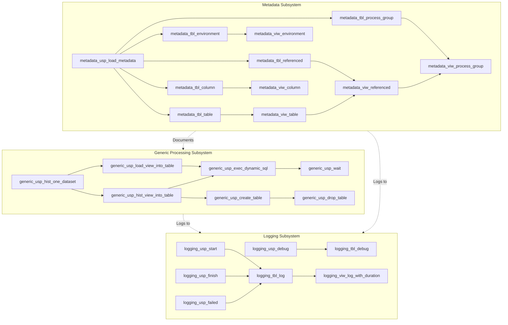

# Documentation `base_features` [back](./../.framework.md)

## Introduction

The Base SQL Feature represents a comprehensive, enterprise-grade data management solution for Teradata environments, built upon three interconnected subsystems: Logging, Generic Data Processing, and Metadata Management. This framework provides the your project with a robust foundation for developing, monitoring, and maintaining complex data workflows while ensuring data quality, auditability, and operational excellence.

At its core, the framework implements industry best practices through modular stored procedures that handle common data management tasks including table creation, data loading, SCD2 historization, and comprehensive error handling. The logging subsystem provides hierarchical tracking of all operations with debug capabilities and performance monitoring, while the metadata management component enables automated dependency detection, impact analysis, and process group organization.

The framework's architecture follows consistent naming conventions where virtual schemas are identified by prefixes (logging, generic, metadata) followed by object type indicators (_tbl_ for tables, _viw_ for views, _usp_ for procedures). This standardization ensures maintainability and clarity across the entire data platform. Key design principles include separation of concerns through modular components, intelligent error handling with automatic retry logic for transient failures, and extensive integration between subsystems to provide end-to-end observability and control of data operations.

## Components of the Framework

| SQL Object Type | Name | Description |
|-----------------|------|-------------|
| Table | [`logging_tbl_debug`](./1-Logging/logging/tables/tbl_debug.md) | Stores detailed debug messages for development and troubleshooting |
| Table | [`logging_tbl_log`](./1-Logging/logging/tables/tbl_log.md) | Main logging table for storing comprehensive log entries |
| View | [`logging_viw_log_with_duration`](./1-Logging/logging/views/viw_log_with_duration.md) | Provides an enhanced view of log entries with calculated durations and statuses |
| Procedure | [`logging_usp_debug`](./1-Logging/logging/procedures/usp_debug.md) | Inserts debug messages into the debug table |
| Procedure | [`logging_usp_failed`](./1-Logging/logging/procedures/usp_failed.md) | Marks log entries as failed and updates related entries |
| Procedure | [`logging_usp_finish`](./1-Logging/logging/procedures/usp_finish.md) | Finalizes log entries with end time and affected rows count |
| Procedure | [`logging_usp_start`](./1-Logging/logging/procedures/usp_start.md) | Initiates new log entries with unique IDs and start times |
| Procedure | [`generic_usp_create_table`](./2-Generic/generic/procedures/usp_create_table.md) | Creates volatile or persistent tables with configurable primary indexes |
| Procedure | [`generic_usp_drop_table`](./2-Generic/generic/procedures/usp_drop_table.md) | Safely drops tables with intelligent error handling |
| Procedure | [`generic_usp_exec_dynamic_sql`](./2-Generic/generic/procedures/usp_exec_dynamic_sql.md) | Executes dynamic SQL with retry logic for deadlocks and spool space issues |
| Procedure | [`generic_usp_hist_one_dataset`](./2-Generic/generic/procedures/usp_hist_one_dataset.md) | Loads single dataset for development testing with validation checks |
| Procedure | [`generic_usp_hist_view_into_table`](./2-Generic/generic/procedures/usp_hist_view_into_table.md) | Implements SCD2 historization from view to table maintaining data lineage |
| Procedure | [`generic_usp_load_view_into_table`](./2-Generic/generic/procedures/usp_load_view_into_table.md) | Performs complete table refresh by loading data from corresponding view |
| Procedure | [`generic_usp_wait`](./2-Generic/generic/procedures/usp_wait.md) | Implements delay mechanism for retry logic and rate limiting |
| Table | [`metadata_tbl_column`](./3-Metadata/metadata/tables/tbl_column.md) | Stores detailed column-level metadata |
| Table | [`metadata_tbl_environment`](./3-Metadata/metadata/tables/tbl_environment.md) | Maintains environment catalog information |
| Table | [`metadata_tbl_process_group`](./3-Metadata/metadata/tables/tbl_process_group.md) | Manages table groupings for processing purposes |
| Table | [`metadata_tbl_referenced`](./3-Metadata/metadata/tables/tbl_referenced.md) | Tracks table dependencies and references |
| Table | [`metadata_tbl_table`](./3-Metadata/metadata/tables/tbl_table.md) | Stores comprehensive table metadata |
| View | [`metadata_viw_column`](./3-Metadata/metadata/tables/viw_column.md) | Provides a consolidated view of column metadata |
| View | [`metadata_viw_environment`](./3-Metadata/metadata/tables/viw_environment.md) | Offers a standardized view of environment information |
| View | [`metadata_viw_process_group`](./3-Metadata/metadata/tables/viw_process_group.md) | Analyzes and presents process group assignments |
| View | [`metadata_viw_referenced`](./3-Metadata/metadata/tables/viw_referenced.md) | Detects and maps table references automatically |
| View | [`metadata_viw_table`](./3-Metadata/metadata/tables/viw_table.md) | Provides a unified view of table metadata |
| Procedure | [`metadata_usp_load_metadata`](./3-Metadata/metadata/procedures/usp_load_metadata.md) | Orchestrates the loading of all metadata components |

## Framework Architecture



## Key Features

**Comprehensive Logging & Monitoring**: The framework provides hierarchical logging capabilities through [`logging_usp_start`](./1-Logging/logging/procedures/usp_start.md), [`logging_usp_finish`](./1-Logging/logging/procedures/usp_finish.md), and [`logging_usp_failed`](./1-Logging/logging/procedures/usp_failed.md), enabling detailed tracking of nested procedures with parent-child relationships. The [`logging_viw_log_with_duration`](./1-Logging/logging/views/viw_log_with_duration.md) view calculates execution durations and provides performance analysis capabilities.

**Intelligent Error Handling**: All generic procedures implement robust error handling with automatic retry logic for transient database errors such as deadlocks and spool space issues. The [`generic_usp_exec_dynamic_sql`](./2-Generic/generic/procedures/usp_exec_dynamic_sql.md) procedure intelligently classifies errors and applies appropriate retry strategies using [`generic_usp_wait`](./2-Generic/generic/procedures/usp_wait.md) for controlled delays.

**SCD2 Historization Support**: The framework implements Slowly Changing Dimension Type 2 patterns through [`generic_usp_hist_view_into_table`](./2-Generic/generic/procedures/usp_hist_view_into_table.md), maintaining complete data lineage with technical validity timestamps (meta_valid_from, meta_valid_to) and actual record flags for point-in-time analysis and historical tracking.

**Automated Metadata Management**: The metadata subsystem automatically captures and organizes database structure information through [`metadata_usp_load_metadata`](./3-Metadata/metadata/procedures/usp_load_metadata.md). The [`metadata_viw_referenced`](./3-Metadata/metadata/tables/viw_referenced.md) view automatically detects table dependencies, while [`metadata_viw_process_group`](./3-Metadata/metadata/tables/viw_process_group.md) assigns logical processing groups and identifies circular references.

**Flexible Table Operations**: The framework supports both volatile and persistent table creation through [`generic_usp_create_table`](./2-Generic/generic/procedures/usp_create_table.md) with configurable primary indexes, and safe table removal via [`generic_usp_drop_table`](./2-Generic/generic/procedures/usp_drop_table.md). Complete table refresh operations are handled by [`generic_usp_load_view_into_table`](./2-Generic/generic/procedures/usp_load_view_into_table.md).

**Development & Testing Support**: The [`generic_usp_hist_one_dataset`](./2-Generic/generic/procedures/usp_hist_one_dataset.md) procedure provides validation and single-dataset loading specifically designed for development environments, while the [`logging_usp_debug`](./1-Logging/logging/procedures/usp_debug.md) procedure enables detailed debugging during development and troubleshooting phases.

**Impact Analysis & Documentation**: Through the metadata subsystem, the framework enables comprehensive impact analysis by tracking table dependencies in [`metadata_tbl_referenced`](./3-Metadata/metadata/tables/tbl_referenced.md) and organizing objects into process groups via [`metadata_tbl_process_group`](./3-Metadata/metadata/tables/tbl_process_group.md), supporting informed decision-making for database changes.

## Practical Coding Examples

### Example 1: Complete ETL Workflow with Logging and Historization

```sql
-- Comprehensive ETL process with full logging and SCD2 historization
DECLARE l_log_id VARCHAR(50);
DECLARE l_status_text VARCHAR(999);

-- Start logging for the entire ETL process
CALL logging_usp_start(
    'ETL_Customer_Master',           -- Process name
    'Loading customer master data',  -- Description
    NULL,                           -- No parent process
    '',                             -- No dynamic SQL to log
    l_log_id                        -- Output: unique log ID
);

-- Log debug information
CALL logging_usp_debug(
    l_log_id,
    'Starting customer data historization from viw_customer_master'
);

-- Perform SCD2 historization
CALL generic_usp_hist_view_into_table(
    't_customer',                   -- Schema name
    'customer_master',              -- Table name
    '',                            -- No specific delete criteria
    1,                             -- Enable debugging
    l_status_text                  -- Output: status message
);

-- Check execution status and finalize logging
IF l_status_text = '' THEN
    -- Success: finish the log entry
    CALL logging_usp_finish(
        l_log_id,
        (SELECT COUNT(*) FROM t_customer_tbl_customer_master WHERE meta_is_actual = 1)
    );
    
    -- Log summary information
    CALL logging_usp_debug(
        l_log_id,
        'Customer historization completed. Active records: ' || 
        (SELECT COUNT(*) FROM t_customer_tbl_customer_master WHERE meta_is_actual = 1)
    );
ELSE
    -- Failure: mark as failed with error message
    CALL logging_usp_failed(l_log_id, l_status_text);
END IF;

-- Query execution results from logging view
SELECT id_log, nm_process, dt_start, dt_end, 
       ni_duration_seconds, nm_status, tx_message
FROM logging_viw_log_with_duration
WHERE id_log = l_log_id;
```

### Example 2: Metadata-Driven Dependency Analysis and Processing

```sql
-- Use metadata framework to identify and process tables in correct order
DECLARE l_log_id VARCHAR(50);
DECLARE l_table_log_id VARCHAR(50);
DECLARE l_status_text VARCHAR(999);

-- Start main process logging
CALL logging_usp_start(
    'Metadata_Driven_Load',
    'Loading tables based on dependency order',
    NULL,
    '',
    l_log_id
);

-- First, refresh metadata to ensure current state
CALL metadata_usp_load_metadata();

-- Process tables by process group order (avoiding circular dependencies)
FOR table_rec AS table_cursor CURSOR FOR
    SELECT pg.nm_schema, pg.nm_table, pg.ni_process_group, 
           t.fn_table, t.fd_table
    FROM metadata_viw_process_group pg
    JOIN metadata_viw_table t ON pg.id_table = t.id_table
    WHERE pg.is_circular_referenced = 0
      AND pg.nm_schema LIKE 't_%'
    ORDER BY pg.ni_process_group, pg.nm_schema, pg.nm_table
DO
    -- Start logging for individual table
    CALL logging_usp_start(
        'Load_' || table_rec.nm_schema || '_' || table_rec.nm_table,
        'Loading: ' || table_rec.fn_table,
        l_log_id,  -- Parent log ID
        '',
        l_table_log_id
    );
    
    -- Load the table
    CALL generic_usp_load_view_into_table(
        table_rec.nm_schema,
        table_rec.nm_table,
        '1=1',  -- Full refresh
        0,      -- No debug for production
        l_status_text
    );
    
    -- Finalize table-level logging
    IF l_status_text = '' THEN
        CALL logging_usp_finish(l_table_log_id, -1);
    ELSE
        CALL logging_usp_failed(l_table_log_id, l_status_text);
    END IF;
END FOR;

-- Finalize main process logging
CALL logging_usp_finish(l_log_id, -1);

-- Generate execution report with dependency hierarchy
SELECT l.id_log, l.nm_process, l.id_log_parent,
       l.dt_start, l.dt_end, l.ni_duration_seconds,
       l.nm_status, t.fn_table AS functional_name
FROM logging_viw_log_with_duration l
LEFT JOIN metadata_viw_table t 
    ON l.nm_process LIKE '%' || t.nm_schema || '_' || t.nm_table || '%'
WHERE l.id_log = l_log_id 
   OR l.id_log_parent = l_log_id
ORDER BY l.dt_start;
```

### Example 3: Development Testing with Validation and Debug Logging

```sql
-- Development workflow: validate, test single dataset, and analyze results
DECLARE l_log_id VARCHAR(50);

-- Enable comprehensive debug logging for development
CALL logging_usp_start(
    'DEV_Test_Transaction_Load',
    'Testing transaction summary load in development',
    NULL,
    '',
    l_log_id
);

-- Log environment information from metadata
CALL logging_usp_debug(
    l_log_id,
    'Environment: ' || (SELECT nm_environment FROM metadata_viw_environment LIMIT 1)
);

-- Test single dataset load with validation
CALL generic_usp_hist_one_dataset(
    't_test_transactions',     -- Test schema
    'transaction_summary',     -- Table name
    1                         -- Enable debug mode
);

-- Analyze results using metadata and logging views
SELECT 
    -- Table metadata
    t.nm_schema, t.nm_table, t.fn_table, t.fd_table,
    -- Column count from metadata
    (SELECT COUNT(*) FROM metadata_viw_column c 
     WHERE c.id_table = t.id_table) AS column_count,
    -- Dependencies
    (SELECT COUNT(*) FROM metadata_viw_referenced r 
     WHERE r.id_table = t.id_table) AS dependency_count,
    -- Process group assignment
    pg.ni_process_group,
    pg.is_circular_referenced
FROM metadata_viw_table t
LEFT JOIN metadata_viw_process_group pg ON t.id_table = pg.id_table
WHERE t.nm_schema = 't_test_transactions'
  AND t.nm_table = 'transaction_summary';

-- Review all debug messages for this test
SELECT ld.dt_timestamp, ld.tx_debug_message
FROM logging_tbl_debug ld
WHERE ld.id_log = l_log_id
ORDER BY ld.dt_timestamp;

-- Finalize test logging
CALL logging_usp_finish(l_log_id, -1);
```

---

## **Utilized ASN GPT Prompt**

**LLM Used:** Claude (Anthropic)
**Prompt Used:** [generate-overall-summery.txt](./../ai_prompts/documentation-sql-related/level-3-of-sql-layer.md)

*end of document*
