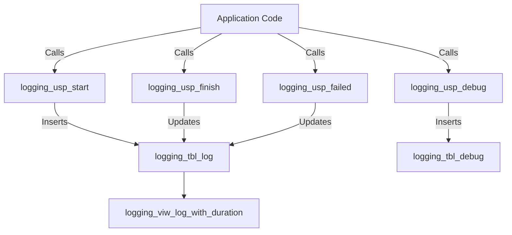

# Logging

## Introduction

The The logging framework was developed to support robust application monitoring, debugging, and performance analysis. This framework consists of several interconnected SQL objects, including tables, views, and stored procedures, designed to capture, store, and analyze log data efficiently. The framework provides a hierarchical logging structure, enabling detailed tracking of nested procedures and processes. It offers features such as debug message logging, error tracking, performance monitoring, and dynamic SQL execution logging. By centralizing logging operations, this framework enhances the team's ability to troubleshoot issues, optimize performance, and maintain a clear audit trail of system activities.

## Components of the Framework

| SQL Object Type | Name | Description |
|-----------------|------|-------------|
| Table | [`logging_tbl_debug`](./logging/tables/tbl_debug.md) | Stores detailed debug messages for development and troubleshooting |
| Table | [`logging_tbl_log`](./logging/tables/tbl_log.md) | Main logging table for storing comprehensive log entries |
| View | [`logging_viw_log_with_duration`](./logging/views/viw_log_with_duration.md) | Provides an enhanced view of log entries with calculated durations and statuses |
| Procedure | [`logging_usp_debug`](./logging/proceduresusp_debug.md) | Inserts debug messages into the debug table |
| Procedure | [`logging_usp_failed`](./logging/proceduresusp_failed.md) | Marks log entries as failed and updates related entries |
| Procedure | [`logging_usp_finish`](./logging/proceduresusp_finish.md) | Finalizes log entries with end time and affected rows count |
| Procedure | [`logging_usp_start`](./logging/proceduresusp_start.md) | Initiates new log entries with unique IDs and start times |

## Framework Architecture

## Key Features

1. **Hierarchical Logging**: Supports parent-child relationships between log entries, enabling tracking of nested procedure calls.

2. **Debug Message Capture**: Dedicated table and procedure for storing and managing debug messages during development and troubleshooting.

3. **Performance Monitoring**: Captures start and end times of procedures, with a view that calculates durations and execution statuses.

4. **Error Tracking**: Stores detailed error information when procedures fail, aiding in quick identification and resolution of issues.

5. **Dynamic SQL Logging**: Capability to log dynamic SQL statements executed by procedures for comprehensive auditing.

6. **Flexible Integration**: Procedures designed to be easily integrated into existing application code for logging at various points.

7. **Centralized Log Management**: All log data is centralized in structured tables, facilitating easy querying and analysis.

8. **Automated Timestamp Management**: Automatic capture of creation timestamps for all log entries.

9. **Scalable Design**: Use of efficient data types and indexing to support high-volume logging scenarios.

10. **Comprehensive Reporting**: The log view provides a rich set of derived data, supporting detailed analysis and reporting of system behavior.

---

**Utilized ASN GPT Prompt**

This was generated with "Complex Claud 4 sonnet"-version

The prompt

Act like a Teradat SQL expert: 
- Given the previous texts, create summary overview of the framework utilized by the DD-OSX team. Handle the following topics
- Leave out "${nm_database_target}" when referencing the procedure, table and/or view name(s) 
- virutal schema the part before "_tbl", "_viw_" of "_usp_" is the virual schema name
- If reference a SQL object make it into a clickable link to the documentation use this format "[`sql-object`](./<virtual-schema-name>/tables/<name-of-table>.md)" for tables and for procedure use "[`sql-object`](./<virtual-schema-name>/procedures/<name-of_procedure>.md)"

- The document structure handle the following topic, in the given order
  - Introduction (MAx 500 words, DO NOT make if longer then is required)
  - Components of the Framework (present as a table with columns SQL Objecttype (procedure, Table or View), Name, Description)
  - Add mermaid Diagram on how the various sql-objects are used and related to one another
    - Let the SQL-objects correlate to the Mermaid diagram, the text of diagram componnets must follow pattern `sql-object-name`.
  - Key Features

*end of document*