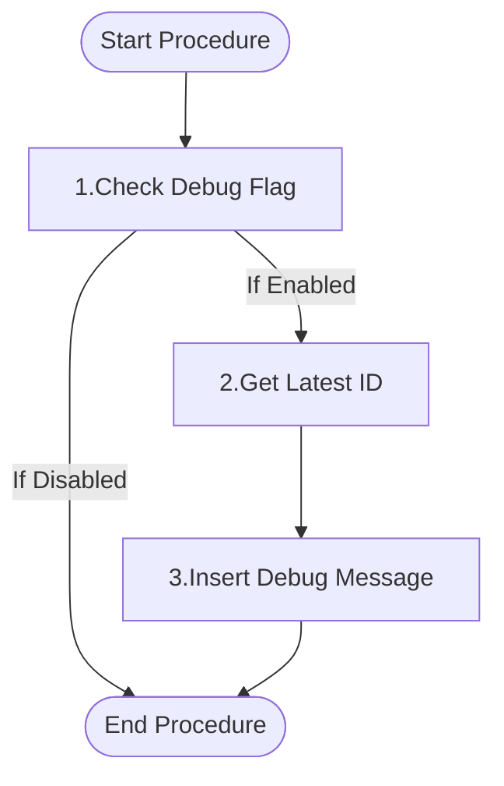

# Functional Description of `logging_usp_debug` ([Back](../regression.md)) [back](../../../.base_feautes.md)

## Purpose

This procedure is designed to log debug messages into a debug table. It only inserts the message if debugging is enabled (ip_is_debugging = 1). This allows for conditional logging during development or troubleshooting, providing a way to track the execution flow and state of the application without affecting performance when debugging is not needed.

## Parameters

| Direction | Parameter | Datatype | Description |
|-----------|-----------|----------|-------------|
| Input | ip_tx_message | VARCHAR(32000) | The debug message to be logged |
| Input | ip_is_debugging | INT | Flag to enable (1) or disable (0) debug logging |

## Logical/functional steps of the procedure

<div style="display: flex;">
<div style="width: 35%;">



</div>
<div style="width: 65%;">

1. **Check Debug Flag**
   - Verify if debugging is enabled by checking if `ip_is_debugging` is set to 1.
   - If debugging is not enabled, the procedure ends without any action.

2. **Get Latest ID**
   - If debugging is enabled, retrieve the next available ID for the debug message.
   - This is done by finding the maximum ID in the `logging_tbl_debug` table and adding 1.

3. **Insert Debug Message**
   - Insert the debug message into the `logging_tbl_debug` table.
   - The new record includes the calculated ID and the provided message text.

</div>
</div>

## Examples

<details>
<summary>Example 1: Logging a Debug Message</summary>

```sql
CREATE PROCEDURE ${nm_database_target}test_logging_usp_debug()
BEGIN
    DECLARE l_tx_message   VARCHAR(32000);
    DECLARE l_is_debugging INT;

    SET l_tx_message   = 'This is a test debug message';
    SET l_is_debugging = 1;

    CALL ${nm_database_target}logging_usp_debug(
        l_tx_message,
        l_is_debugging
    );

    -- Verify the debug message was logged
    SELECT *
    FROM ${nm_database_target}logging_tbl_debug
    WHERE 1=1
      AND tx_message = 'This is a test debug message'
    ORDER BY id DESC
    LIMIT 1;
END;

CALL ${nm_database_target}test_logging_usp_debug();

DROP PROCEDURE ${nm_database_target}test_logging_usp_debug;
```
</details>

<details>
<summary>Example 2: Debugging Disabled</summary>

```sql
CREATE PROCEDURE ${nm_database_target}test_logging_usp_debug_disabled()
BEGIN
    DECLARE l_tx_message   VARCHAR(32000);
    DECLARE l_is_debugging INT;
    DECLARE l_initial_count INT;
    DECLARE l_final_count   INT;

    SET l_tx_message   = 'This message should not be logged';
    SET l_is_debugging = 0;

    -- Get initial count of debug messages
    SELECT COUNT(*) INTO l_initial_count
    FROM ${nm_database_target}logging_tbl_debug;

    CALL ${nm_database_target}logging_usp_debug(
        l_tx_message,
        l_is_debugging
    );

    -- Get final count of debug messages
    SELECT COUNT(*) INTO l_final_count
    FROM ${nm_database_target}logging_tbl_debug;

    -- Verify no new message was added
    IF l_initial_count = l_final_count THEN
        SELECT 'Debug message was not logged as expected' AS result;
    ELSE
        SELECT 'Unexpected: Debug message was logged' AS result;
    END IF;
END;

CALL ${nm_database_target}test_logging_usp_debug_disabled();

DROP PROCEDURE ${nm_database_target}test_logging_usp_debug_disabled;
```
</details>

---

**Utilized ASN GPT Prompt**

> **LLM Used:** Claude (Anthropic)
> **Prompt Used:** [level-1-powershell-script](./../.ai_prompts/documentation-related-to-powershell/level-1-powershell-script.tx)

*end of document*
