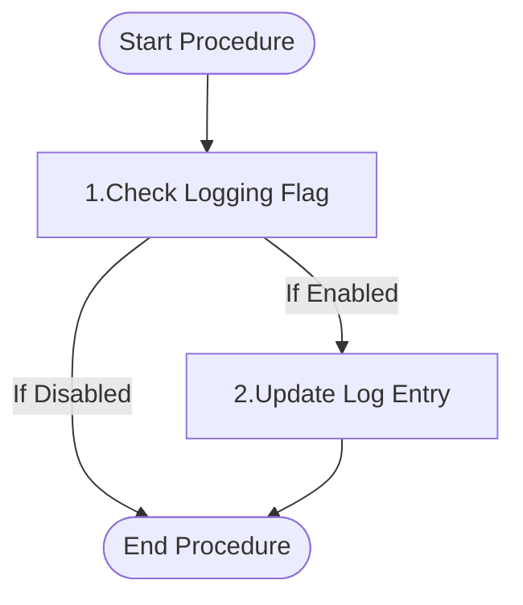

# Functional Description of `logging_usp_finish` ([Back](../regression.md)) [back](../../../.base_feautes.md)

## Purpose

This procedure is designed to finalize a logging entry in the `logging_tbl_log` table. It updates the log record with the end time and the number of affected rows or items. This procedure is typically called at the successful completion of a process to mark its end and record its impact.

## Parameters

| Direction | Parameter | Datatype | Description |
|-----------|-----------|----------|-------------|
| Input | ip_id_log | CHAR(64) | The unique identifier of the log entry to be finalized |
| Input | ip_affected | INT | The number of rows or items affected by the process |
| Input | ip_is_logging_on | INT | Flag to enable (1) or disable (0) logging |

## Logical/functional steps of the procedure

<div style="display: flex;">
<div style="width: 35%;">



</div>
<div style="width: 65%;">

1. **Check Logging Flag**
   - Verify if logging is enabled by checking if `ip_is_logging_on` is set to 1.
   - If logging is not enabled, the procedure ends without any action.

2. **Update Log Entry**
   - If logging is enabled, update the `logging_tbl_log` table for the specified `ip_id_log`.
   - Set the `log_ended` timestamp to the current time.
   - Set the `affected` column to the value provided in `ip_affected`.

</div>
</div>

## Examples

<details>
<summary>Example 1: Finishing a Log Entry</summary>

```sql
CREATE PROCEDURE ${nm_database_target}test_logging_usp_finish()
BEGIN
    DECLARE l_id_log        CHAR(64);
    DECLARE l_affected      INT;
    DECLARE l_is_logging_on INT;

    -- Simulate creating a log entry
    SET l_id_log = 'TEST_FINISH_123';
    INSERT INTO ${nm_database_target}logging_tbl_log (id_log, procedure_name, log_started)
    VALUES (l_id_log, 'test_procedure', CURRENT_TIMESTAMP);

    SET l_affected      = 100;
    SET l_is_logging_on = 1;

    CALL ${nm_database_target}logging_usp_finish(
        l_id_log,
        l_affected,
        l_is_logging_on
    );

    -- Verify the log entry was updated
    SELECT id_log, procedure_name, log_started, log_ended, affected
    FROM ${nm_database_target}logging_tbl_log
    WHERE 1=1
      AND id_log = l_id_log;

    -- Clean up
    DELETE FROM ${nm_database_target}logging_tbl_log WHERE id_log = l_id_log;
END;

CALL ${nm_database_target}test_logging_usp_finish();

DROP PROCEDURE ${nm_database_target}test_logging_usp_finish;
```
</details>

<details>
<summary>Example 2: Finishing a Log Entry with Logging Disabled</summary>

```sql
CREATE PROCEDURE ${nm_database_target}test_logging_usp_finish_disabled()
BEGIN
    DECLARE l_id_log        CHAR(64);
    DECLARE l_affected      INT;
    DECLARE l_is_logging_on INT;
    DECLARE l_initial_end   TIMESTAMP;
    DECLARE l_final_end     TIMESTAMP;

    -- Simulate creating a log entry
    SET l_id_log = 'TEST_FINISH_DISABLED_123';
    INSERT INTO ${nm_database_target}logging_tbl_log (id_log, procedure_name, log_started)
    VALUES (l_id_log, 'test_procedure_disabled', CURRENT_TIMESTAMP);

    -- Get initial log_ended value
    SELECT log_ended INTO l_initial_end
    FROM ${nm_database_target}logging_tbl_log
    WHERE id_log = l_id_log;

    SET l_affected      = 200;
    SET l_is_logging_on = 0;  -- Logging disabled

    CALL ${nm_database_target}logging_usp_