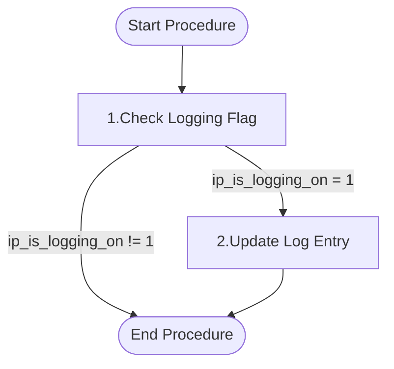

# Functional Description of `usp_finish` [back](../../../.base_feautes.md)

## Purpose

This procedure is designed to finalize a logging entry in the `tbl_log` table. It updates the log record with the end time and the number of affected rows, if logging is enabled. This procedure is typically used to mark the completion of a logged operation and record its impact.

## Parameters

| Direction | Parameter | Datatype | Description |
|-----------|-----------|----------|-------------|
| IN | ip_id_log | CHAR(64) | The unique identifier of the log entry to be finalized |
| IN | ip_affected | INT | The number of rows affected by the logged operation |
| IN | ip_is_logging_on | INT | A flag to determine if logging is enabled (1) or disabled (0) |

## Logical/functional steps of the procedure

<table>
<tr>
<td width="35%">



</td>
<td width="65%">

1. **Check Logging Flag**
   - Verify if logging is enabled by checking if `ip_is_logging_on` equals 1.

2. **Update Log Entry**
   - If logging is enabled, update the `tbl_log` table for the specified `ip_id_log`.
   - Set `log_ended` to the current timestamp.
   - Set `affected` to the provided `ip_affected` value.

</td>
</tr>
</table>

## Examples

<details>
<summary>Example 1: Finishing a log entry with affected rows</summary>

```sql
CREATE PROCEDURE test_usp_finish()
BEGIN
    DECLARE l_id_log        CHAR(64);
    DECLARE l_affected      INT;
    DECLARE l_is_logging_on INT;

    SET l_id_log        = 'LOG123456';
    SET l_affected      = 100;
    SET l_is_logging_on = 1;

    CALL t_l2_func_test.mbdt_logging_usp_finish(l_id_log, l_affected, l_is_logging_on);

    -- Verify the update
    SELECT id_log, log_ended, affected
    FROM t_l2_func_test.mbdt_logging_tbl_log
    WHERE id_log = l_id_log;
END;

CALL test_usp_finish();

DROP PROCEDURE test_usp_finish;
```
</details>

<details>
<summary>Example 2: Calling the procedure with logging disabled</summary>

```sql
CREATE PROCEDURE test_usp_finish_disabled()
BEGIN
    DECLARE l_id_log        CHAR(64);
    DECLARE l_affected      INT;
    DECLARE l_is_logging_on INT;

    SET l_id_log        = 'LOG789012';
    SET l_affected      = 50;
    SET l_is_logging_on = 0;

    CALL t_l2_func_test.mbdt_logging_usp_finish(l_id_log, l_affected, l_is_logging_on);

    -- Verify that no update occurred
    SELECT id_log, log_ended, affected
    FROM t_l2_func_test.mbdt_logging_tbl_log
    WHERE id_log = l_id_log;
END;

CALL test_usp_finish_disabled();

DROP PROCEDURE test_usp_finish_disabled;
```
</details>

---

**Utilized ASN GPT Prompt**

<details>
<summary>The prompt</summary>

Act like a Teradat SQL expert: 
- Provide functional descption of the "Procedure" in the file of the attachment. 
- Leave out "t_l2_func_test.mbdt_logging_" when referencing the procedure, table and/or view name(s) 

The document structure should have the topics in the give order: 
- Tilte should be "Functional Descripton of `<name-of-procedure>` ([Back](../regression.md))"
- Purpuse
  - This is short description, do NOT make it longer then required to get a general description of the purpuse of the procedure.
  - Max 200 words.
- Parameters
  - If there are None, skip this part.
  - Input (and if applicable Output), present these in table with columns direction, parameter, datatype and description.
- Logical/functional steps of the procedure
  - This has two columns, column 1 width 35% has the mermaid diagram, column 2 width 65% lists the steps with descriptions
  - Add Mermaid Diagram
    - Diagram should have `Start Procedure` and `End Procedure` using the formatting `SP([Start Procedure])` and `EP([End Procedure])`
    - Other process steps shoul have the following formatting `[...]`
  - number the logical/functional step
  - per step provide title in bold format
  - per step provide short description, if other objects are reference these can be shown, use `name-object`-format
  - Let the Steps correlate to the Mermaid diagram, the text of diagram block must follow pattern `#.step-name`,  # is substituted by the number correlating with the step.
- Examples
   - Provide two example in utilization of this procedure, each example in a separate code block, the code blocks must be calapsable. 
   - Inlcude declare for all paramters using a 'l_'-prefix for local variables. 
   - If there are input and/or output parameter rap it into a temporal test procdure that will be dropped at the end of the code. 
   - variable in the temporal procedure have the prefix `l_`
   - declared varaible must be align, the datatype should all start at the same position, if default are used align them also.
   - Do use the fullname of the procedure, for example 't_l2_func_test.regression_usp_result'.
   - If there is a table being populated add select-statement, in the where clause the filter value should be aligned.
   - cleanup any temporal procedures

- At the End of the document after the Examples, add the following in the give order.
  - divider line
  - text **Utilized ASN GPT Prompt**
  - calapsable text block with the used ASN GPT prompt, title "the prompt" without everthing after "procdure text:"
  - Add final blank line
  - Add the text "*end of document*"
  - Add final blank line

</details>

*end of document*