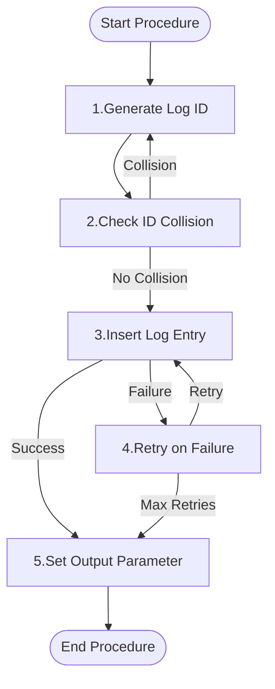

# Functional Description of `logging_usp_start` [back](../../../.base_feautes.md)

## Purpose

This procedure initiates a logging entry in the `logging_tbl_log` table. It generates a unique log ID, handles potential ID collisions, and attempts to insert the log entry with retry logic. The procedure is designed to track the start of processes, capturing details such as the procedure name, message text, and any dynamic SQL involved. It supports nested logging through the parent log ID parameter.

## Parameters

| Direction | Parameter | Datatype | Description |
|-----------|-----------|----------|-------------|
| Input | ip_id_log_parent | CHAR(64) | Parent log ID for nested logging |
| Input | ip_procedure_name | VARCHAR(128) | Name of the procedure being logged |
| Input | ip_message_text | VARCHAR(999) | Message describing the log entry |
| Input | ip_dynamic_sql_text | VARCHAR(32000) | Dynamic SQL text, if applicable |
| Input | ip_is_logging_on | INT | Flag to enable (1) or disable (0) logging |
| Output | op_id_log | CHAR(64) | Generated unique log ID |

## Logical/functional steps of the procedure

<div style="display: flex;">
<div style="width: 35%;">



</div>
<div style="width: 65%;">

1. **Generate Log ID**
   - Create a unique log ID using SHA256 hash of procedure name, message, and timestamp.

2. **Check ID Collision**
   - Verify if the generated ID already exists in the `logging_tbl_log` table.
   - If a collision occurs, regenerate the ID.

3. **Insert Log Entry**
   - If logging is enabled, attempt to insert the log entry into `logging_tbl_log`.

4. **Retry on Failure**
   - If the insert fails, retry up to 3 times.

5. **Set Output Parameter**
   - Set the `op_id_log` output parameter to the generated log ID.

</div>
</div>

## Examples

<details>
<summary>Example 1: Starting a Log Entry</summary>

```sql
CREATE PROCEDURE ${nm_database_target}test_logging_usp_start()
BEGIN
    DECLARE l_id_log_parent  CHAR(64);
    DECLARE l_procedure_name VARCHAR(128);
    DECLARE l_message_text   VARCHAR(999);
    DECLARE l_dynamic_sql    VARCHAR(32000);
    DECLARE l_is_logging_on  INT;
    DECLARE l_id_log         CHAR(64);

    SET l_id_log_parent  = NULL;
    SET l_procedure_name = 'test_procedure';
    SET l_message_text   = 'Testing logging_usp_start';
    SET l_dynamic_sql    = 'SELECT * FROM example_table';
    SET l_is_logging_on  = 1;

    CALL ${nm_database_target}logging_usp_start(
        l_id_log_parent,
        l_procedure_name,
        l_message_text,
        l_dynamic_sql,
        l_is_logging_on,
        l_id_log
    );

    -- Verify the log entry was created
    SELECT id_log, procedure_code, message_text, dynamic_sql_text, log_start
    FROM ${nm_database_target}logging_tbl_log
    WHERE 1=1
      AND id_log = l_id_log;

    -- Clean up
    DELETE FROM ${nm_database_target}logging_tbl_log WHERE id_log = l_id_log;
END;

CALL ${nm_database_target}test_logging_usp_start();

DROP PROCEDURE ${nm_database_target}test_logging_usp_start;
```
</details>

<details>
<summary>Example 2: Nested Logging</summary>

```sql
CREATE PROCEDURE ${nm_database_target}test_logging_usp_start_nested()
BEGIN
    DECLARE l_parent_id_log  CHAR(64);
    DECLARE l_child_id_log   CHAR(64);
    DECLARE l_procedure_name VARCHAR(128);
    DECLARE l_message_text   VARCHAR(999);
    DECLARE l_is_logging_on  INT;

    SET l_procedure_name = 'parent_procedure';
    SET l_message_text   = 'Parent log entry';
    SET l_is_logging_on  = 1;

    -- Create parent log entry
    CALL ${nm_database_target}logging_usp_start(
        NULL,
        l_procedure_name,
        l_message_text,
        NULL,
        l_is_logging_on,
        l_parent_id_log
    );

    -- Create child log entry
    SET l_procedure_name = 'child_procedure';
    SET l_message_text   = 'Child log entry';

    CALL ${nm_database_target}logging_usp_start(
        l_parent_id_log,
        l_procedure_name,
        l_message_text,
        NULL,
        l_is_logging_on,
        l_child_id_log
    );

    -- Verify the nested log entries
    SELECT id_log, id_log_parent, procedure_code, message_text
    FROM ${nm_database_target