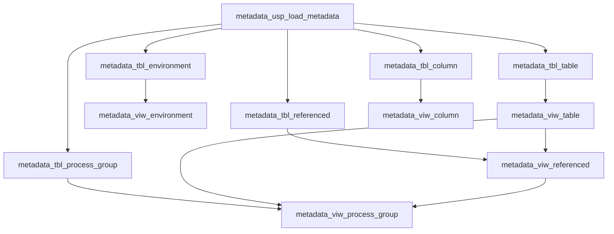

# Metadata

## Introduction

The metadata management framework for Teradata environments. This framework is designed to capture, organize, and utilize metadata across various database objects, enabling efficient data governance, impact analysis, and process management. The system comprises several interconnected components including tables, views, and stored procedures that work together to provide a holistic view of the database ecosystem.

The framework focuses on managing metadata for tables, columns, environments, and process groups. It allows for the automatic detection of table references, assignment of processing groups, and identification of circular dependencies. By leveraging this metadata, the framework supports various data management activities such as ETL process optimization, data lineage tracking, and comprehensive documentation of database structures.

Key aspects of the framework include its ability to parse and store functional descriptions from table comments, map relationships between tables and views, and provide a structured approach to organizing database objects into logical processing groups. This enables data professionals to better understand and manage complex database environments, support impact analysis for changes, and maintain consistent documentation across the data landscape.

## Components of the Framework

| SQL Object Type | Name | Description |
|-----------------|------|-------------|
| Table | [`metadata_tbl_column`](./tables/metadata_tbl_column.md) | Stores detailed column-level metadata |
| Table | [`metadata_tbl_environment`](./tables/metadata_tbl_environment.md) | Maintains environment catalog information |
| Table | [`metadata_tbl_process_group`](./tables/metadata_tbl_process_group.md) | Manages table groupings for processing purposes |
| Table | [`metadata_tbl_referenced`](./tables/metadata_tbl_referenced.md) | Tracks table dependencies and references |
| Table | [`metadata_tbl_table`](./tables/metadata_tbl_table.md) | Stores comprehensive table metadata |
| View | [`metadata_viw_column`](./tables/metadata_viw_column.md) | Provides a consolidated view of column metadata |
| View | [`metadata_viw_environment`](./tables/metadata_viw_environment.md) | Offers a standardized view of environment information |
| View | [`metadata_viw_process_group`](./tables/metadata_viw_process_group.md) | Analyzes and presents process group assignments |
| View | [`metadata_viw_referenced`](./tables/metadata_viw_referenced.md) | Detects and maps table references automatically |
| View | [`metadata_viw_table`](./tables/metadata_viw_table.md) | Provides a unified view of table metadata |
| Procedure | [`metadata_usp_load_metadata`](./procedures/metadata_usp_load_metadata.md) | Orchestrates the loading of all metadata components |

## Framework Architecture



## Key Features

1. **Comprehensive Metadata Capture**: The framework captures detailed metadata for tables, columns, environments, and processing groups, providing a rich repository of information about the database structure and relationships.

2. **Automated Reference Detection**: Through the [`metadata_viw_referenced`](./tables/metadata_viw_referenced.md) view, the system automatically identifies and maps table dependencies by analyzing view definitions.

3. **Process Group Management**: The [`metadata_viw_process_group`](./tables/metadata_viw_process_group.md) view enables the organization of tables into logical processing groups, facilitating efficient ETL workflows and dependency management.

4. **Environment Catalog**: The [`metadata_tbl_environment`](./tables/metadata_tbl_environment.md) table and its associated view provide a centralized registry of database environments, supporting multi-environment management.

5. **Functional Descriptions**: The framework extracts and stores functional names and descriptions from table comments, enhancing documentation and understanding of data assets.

6. **Impact Analysis Support**: By maintaining detailed reference and dependency information, the framework enables comprehensive impact analysis for proposed changes to the database structure.

7. **Centralized Metadata Loading**: The [`metadata_usp_load_metadata`](./procedures/metadata_usp_load_metadata.md) procedure orchestrates the loading of all metadata components, ensuring consistency across the metadata repository.

## Practical Coding Examples

1. Analyzing Table Dependencies:

```sql
WITH RECURSIVE dependency_chain AS (
    SELECT id_table, id_table_referenced, 1 AS depth
    FROM metadata_viw_referenced
    WHERE id_table = 'starting_table_id'
    UNION ALL
    SELECT r.id_table, r.id_table_referenced, dc.depth + 1
    FROM metadata_viw_referenced r
    JOIN dependency_chain dc ON r.id_table = dc.id_table_referenced
    WHERE dc.depth < 5
)
SELECT dc.id_table, dc.id_table_referenced, dc.depth,
       t1.nm_schema || '.' || t1.nm_table AS referencing_table,
       t2.nm_schema || '.' || t2.nm_table AS referenced_table
FROM dependency_chain dc
JOIN metadata_viw_table t1 ON dc.id_table = t1.id_table
JOIN metadata_viw_table t2 ON dc.id_table_referenced = t2.id_table
ORDER BY dc.depth, t1.nm_schema, t1.nm_table;
```

2. Identifying Tables with Missing Documentation:

```sql
SELECT nm_schema, nm_table, fn_table, fd_table
FROM metadata_viw_table
WHERE fn_table = 'n/a' OR fd_table = 'n/a'
ORDER BY nm_schema, nm_table;
```

3. Analyzing Process Group Assignments:

```sql
SELECT pg.nm_schema, pg.nm_table, pg.ni_process_group,
       t.fn_table, t.fd_table,
       CASE WHEN pg.is_circular_referenced = 1 THEN 'Yes' ELSE 'No' END AS has_circular_reference
FROM metadata_viw_process_group pg
JOIN metadata_viw_table t ON pg.id_table = t.id_table
ORDER BY pg.ni_process_group, pg.nm_schema, pg.nm_table;
```

---

**Utilized ASN GPT Prompt**

This was generated with "Complex Claude 4 sonnet"-version

<details>
<summary>the prompt</summary>

Act like a Teradat SQL expert: 
- Given the previous texts, create summary overview of the framework utilized by the DD-OSX team. Handle the following topics
- Leave out "${nm_database_target}" when referencing the procedure, table and/or view name(s) 
- If reference a SQL object make it into a clickable link to the documentation use this format "[`sql-object`](./tables/<name-of-table>.md)" for tables and for procedure use "[`sql-object`](./procedures/<name-of_procedure>.md)"

- The document structure handle the following topic, in the given order
  - Introduction (MAx 500 words, DO NOT make if longer then is required)
  - Components of the Framework (present as a table with columns SQL Objecttype (procedure, Table or View), Name, Description)
  - Add mermaid Diagram on how the various sql-objects are used and related to one another
  - Let the SQL-objects correlate to the Mermaid diagram, the text of diagram componnets must follow pattern `sql-object-name`.
  - Key Features
  - Provide 2 ro 3 practical coding examples

- At the End of the document, add the following in the give order.
  - divider line
  - text **Utilized ASN GPT Prompt**
  - This was generated with "Complex Claud 4 sonnet"-version
  - calapsable text block with the used ASN GPT prompt, title "the prompt"
  - Add final blank line
  - Add the text "*end of document*"
  - Add final blank line
</details>

*end of document*