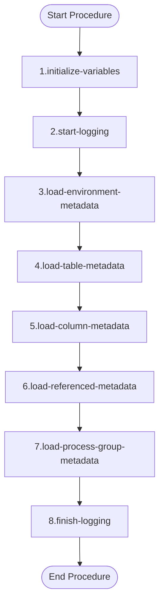

# Functional Description of `metadata_usp_load_metadata` ([Back](../regression.md))

## Purpose

The `metadata_usp_load_metadata` procedure serves as the main orchestrator for loading comprehensive metadata into the DD-OSX metadata framework. This procedure systematically populates all five core metadata tables by calling the generic data loading utility for each metadata component. It handles the complete refresh of environment catalogs, table definitions, column specifications, table references, and process group assignments in a coordinated sequence, ensuring data consistency across the entire metadata repository.

## Parameters

| Direction | Parameter | Datatype | Description |
|-----------|-----------|----------|-------------|
| IN | ip_is_debugging | INT | Debug flag to enable detailed logging during execution (1=enabled, 0=disabled) |

## Logical/Functional Steps of the Procedure

<table>
<tr>
<td width="35%">



</td>
<td width="65%">

1. **Initialize Variables and Error Handling**
   - Set up local variables for logging and error handling
   - Configure error handler to capture SQL exceptions
   - Initialize procedure name and message text variables

2. **Start Logging Process**
   - Call `logging_usp_start` to initialize audit trail
   - Set message text describing the metadata loading operation
   - Generate unique log ID for tracking procedure execution

3. **Load Environment Metadata**
   - Call `generic_usp_load_view_into_table` for `metadata_tbl_environment`
   - Perform complete refresh (delete criteria '1=1')
   - Load environment catalog information

4. **Load Table Metadata**
   - Call `generic_usp_load_view_into_table` for `metadata_tbl_table`
   - Perform complete refresh of table catalog
   - Load comprehensive table definitions and view SQL

5. **Load Column Metadata**
   - Call `generic_usp_load_view_into_table` for `metadata_tbl_column`
   - Perform complete refresh of column specifications
   - Load detailed column-level metadata

6. **Load Referenced Metadata**
   - Call `generic_usp_load_view_into_table` for `metadata_tbl_referenced`
   - Perform complete refresh of table dependencies
   - Load table reference relationships

7. **Load Process Group Metadata**
   - Call `generic_usp_load_view_into_table` for `metadata_tbl_process_group`
   - Perform complete refresh of process group assignments
   - Load table grouping information

8. **Finish Logging Process**
   - Call `logging_usp_finish` to complete audit trail
   - Mark procedure execution as completed successfully

</td>
</tr>
</table>

## Examples

<details>
<summary>Example 1: Standard Metadata Load with Debugging</summary>

```sql
-- Standard metadata load execution with debugging enabled
BEGIN
    DECLARE l_is_debugging INT DEFAULT 1;
    
    -- Execute metadata load procedure
    CALL ${nm_database_target}metadata_usp_load_metadata(l_is_debugging);
    
    -- Verify results
    SELECT COUNT(*) as environment_count FROM ${nm_database_target}metadata_tbl_environment;
    SELECT COUNT(*) as table_count       FROM ${nm_database_target}metadata_tbl_table;
    SELECT COUNT(*) as column_count      FROM ${nm_database_target}metadata_tbl_column;
    SELECT COUNT(*) as reference_count   FROM ${nm_database_target}metadata_tbl_referenced;
    SELECT COUNT(*) as process_group_count FROM ${nm_database_target}metadata_tbl_process_group;
END;
```

</details>

<details>
<summary>Example 2: Silent Metadata Load for Production</summary>

```sql
-- Production metadata load execution without debugging
BEGIN
    DECLARE l_is_debugging INT DEFAULT 0;
    
    -- Execute metadata load procedure silently
    CALL ${nm_database_target}metadata_usp_load_metadata(l_is_debugging);
    
    -- Check specific metadata after load
    SELECT 
        t.nm_schema,
        t.nm_table,
        t.fn_table,
        COUNT(c.id_column) as column_count
    FROM ${nm_database_target}metadata_tbl_table t
    LEFT JOIN ${nm_database_target}metadata_tbl_column c ON t.id_table = c.id_table
    WHERE t.nm_schema = 'customer'
      AND t.meta_dt_created_at >= CURRENT_DATE
    GROUP BY t.nm_schema, t.nm_table, t.fn_table
    ORDER BY t.nm_table;
END;
```

</details>

---

**Utilized ASN GPT Prompt**

<details>
<summary>the prompt</summary>

Act like a Teradat SQL expert: 
- Provide functional descption of the "Procedure" in the file of the attachment. 
- Leave out "${nm_database_target}" when referencing the procedure, table and/or view name(s)
- understand that part before "_usp_" is the functional schema name

The document structure should have the topics in the give order: 
- Tilte should be "Functional Descripton of `<name-of-procedure>` ([Back](../regression.md))"
- Purpuse
  - This is short description, do NOT make it longer then required to get a general description of the purpuse of the procedure.
  - Max 200 words.
- Parameters
  - If there are None, skip this part.
  - Input (and if applicable Output), present these in table with columns direction, parameter, datatype and description.
- Logical/functional steps of the procedure
  - This has two columns, column 1 width 35% has the mermaid diagram, column 2 width 65% lists the steps with descriptions
  - Add Mermaid Diagram
    - Diagram should have `Start Procedure` and `End Procedure` using the formatting `SP([Start Procedure])` and `EP([End Procedure])`
    - Other process steps shoul have the following formatting `[...]`
  - number the logical/functional step
  - per step provide title in bold format
  - per step provide short description, if other objects are reference these can be shown, use `name-object`-format
  - Let the Steps correlate to the Mermaid diagram, the text of diagram block must follow pattern `#.step-name`,  # is substituted by the number correlating with the step.
- Examples
   - Use ${nm_database_target} parameter in the SQL Example! (USe find and replace to insert the correct database for the enviroment the dataset is tested on, in DBeaver these parameters can be pre-set)
   - Provide two example in utilization of this procedure, each example in a separate code block, the code blocks must be calapsable. 
   - Inlcude declare for all paramters using a 'l_'-prefix for local variables. 
   - If there are input and/or output parameter rap it into a temporal test procdure that will be dropped at the end of the code. 
   - variable in the temporal procedure have the prefix `l_`
   - declared varaible must be align, the datatype should all start at the same position, if default are used align them also.
   - Do use the fullname of the procedure, for example 't_l2_func_test.regression_usp_result'.
   - If there is a table being populated add select-statement, in the where clause the filter value should be aligned.
   - cleanup any temporal procedures

- At the End of the document after the Examples, add the following in the give order.
  - divider line
  - text **Utilized ASN GPT Prompt**
  - calapsable text block with the used ASN GPT prompt, title "the prompt" without everthing after "procdure text:"
  - Add final blank line
  - Add the text "*end of document*"
  - Add final blank line

</details>

*end of document*