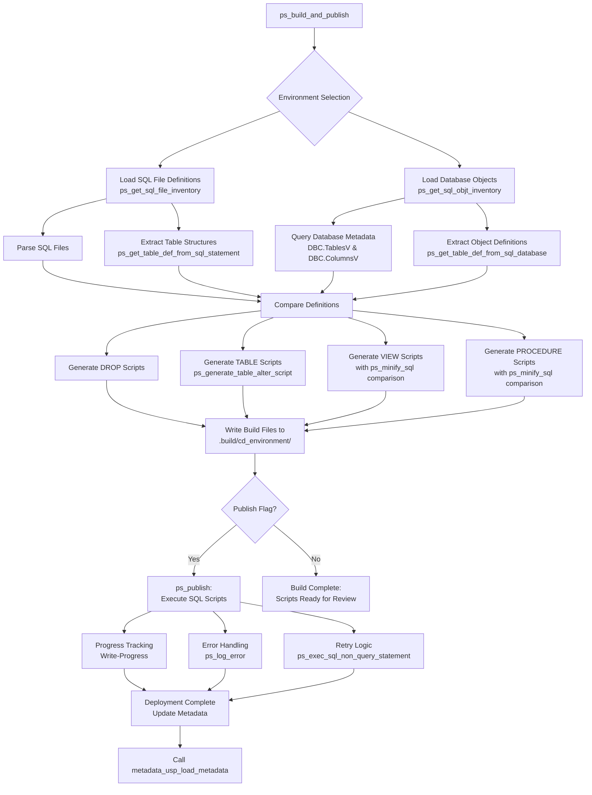

# PowerShell Database Deployment Framework

## Introduction

The PowerShell Database Deployment Framework is a comprehensive automation solution engineered to streamline database schema management and deployment processes across multiple Teradata environments. This framework empowers data engineers, database architects, and technical leads to maintain consistency between SQL definition files and live database objects through automated comparison, differential analysis, and controlled deployment pipelines with enterprise-grade reliability.

The framework operates on a dual-phase approach: **Build** and **Publish**. During the Build phase, the system performs comprehensive analysis by extracting table, view, and procedure definitions from both SQL files and live database objects, then generates targeted SQL scripts for necessary changes. The Publish phase executes these generated scripts in a controlled manner with comprehensive logging, retry logic, and progress tracking.

Built with enterprise reliability in mind, the framework incorporates advanced features including intelligent retry mechanisms for transient database errors, secure credential management with encrypted storage, comprehensive event logging, and environment-specific parameter substitution. The modular architecture ensures maintainability while supporting complex deployment scenarios across development (O), test (T), acceptance (A), and production (P) environments.

The system is particularly valuable for organizations implementing continuous integration/continuous deployment (CI/CD) practices for database changes, providing automated validation, data type conversion risk assessment, and comprehensive impact analysis. By centralizing deployment logic and maintaining detailed audit trails, it significantly reduces manual errors while ensuring consistent database schema evolution across all environments. The framework's sophisticated data type conversion assessment engine analyzes precision, scale, and length changes, providing risk-level classifications and recommendations for safe schema migrations.



### Folder Structure

```Text
Project Root/
├── .framework/                      # Core framework components
│   ├── .base_features/              # Base database features (logging, metadata)
│   ├── .deployment/                 # Deployment artifacts
│   │   └── .build/                  # Generated SQL scripts per environment
│   │       ├── O/                   # Development (Ontwikkel) environment scripts
│   │       ├── T/                   # Test environment scripts
│   │       ├── A/                   # Acceptance environment scripts
│   │       └── P/                   # Production environment scripts
│   └── .scripts/                    # PowerShell modules
│       ├── classes.ps1              # cl_column and cl_table class definitions
│       ├── functions.ps1            # Core SQL operations and utilities
│       └── build_and_publish.ps1    # Build and publish orchestration
├── project/                         # Project-specific components
│   ├── .configuration/              
│   │   └── .environments.ps1        # Environment configuration (DSN, parameters)
│   └── definitions/                 # SQL definition files organized by schema
│       ├── <grouping>/              # Logical grouping (e.g., 1-logging, 2-generic)
│       │   ├── <schema>/            # Schema name (e.g., metadata, inbound)
│       │   │   ├── tables/          # Table CREATE statements
│       │   │   ├── views/           # View CREATE OR REPLACE statements
│       │   │   └── procedures/      # Stored procedure definitions
│       │   │       └── <object>.sql # Individual object definition files
└── main.ps1                         # Primary execution entry point
```

## Build Process

### Gathering Definitions from SQL Files

The build process begins with the `ps_get_sql_file_inventory` function systematically scanning the folder structure to inventory all SQL definition files. The function recursively traverses `$global:fp_root\.framework\.base_features` and `$global:fp_root\project\definitions` directories, discovering all `.sql` files while maintaining their organizational context.

**File Classification and Metadata Extraction**: Each discovered file's path is parsed to extract classification information following the pattern `<grouping>/<schema>/<type>/<object>.sql`. The `$pathParts` array splits the relative path into components, populating:
- `nm_grouping`: Logical grouping identifier (e.g., "1-logging", "2-generic")
- `nm_schema`: Target schema name
- `cd_type`: Object type ("tables", "views", "procedures")
- `nm_object`: Base object name (filename without .sql extension)
- `ni_ordering`: Sequential ordering number for controlled deployment

**Dynamic Parameter Substitution**: SQL file content undergoes environment-specific token replacement through a sophisticated substitution engine. The system reads the entire file content with `Get-Content -Raw`, then performs sequential replacements:
```powershell
$tx_object = $tx_object.Replace('${cd_environment}', $ip_environment.cd_environment)
$tx_object = $tx_object.Replace('${nm_environment}', $ip_environment.nm_environment)
$tx_object = $tx_object.Replace('${nm_database}', $ip_environment.nm_database)
```
Additional custom parameters defined in the environment configuration are dynamically substituted through a loop processing `$ip_environment.parameters`, enabling flexible environment-specific behavior without maintaining multiple file copies.

**Comment Processing**: The `ps_remove_comments` function strips both single-line (`--`) and multi-line (`/* */`) comments while preserving quoted strings. The function implements quote-awareness by tracking quote states (`$inQuote`, `$quoteChar`) to ensure comment markers within string literals are not processed. This normalization facilitates accurate comparison operations.

**Table Structure Parsing**: For files in the `tables` folder, `ps_get_table_def_from_sql_statement` employs sophisticated regular expression pattern matching to extract comprehensive table metadata:
```powershell
$columnPattern = '\[?(\w+)\]?\s+([A-Z]+(?:\([^)]+\))?)\s*(NOT\s+NULL|NULL)?\s*(?:DEFAULT\s+([^,\s]+))?(?:,|\s*\))'
```
This pattern captures column names, complete data type specifications (including length/precision/scale), nullability constraints, and default values. The extracted information populates `cl_column` objects with properties including `DataType`, `MaxLength`, `Precision`, `Scale`, `IsNullable`, `DefaultValue`, and `OrdinalPosition`. For data types requiring parameters (VARCHAR, DECIMAL, etc.), the function parses and stores dimension information, building complete DDL-ready data type strings like "VARCHAR(255)" or "DEC(18,2)".

**Modified Date Tracking**: The function captures file modification timestamps using `$file.LastWriteTime` and `$file.CreationTime`, selecting the most recent to enable temporal comparison with database objects. This timestamp comparison determines whether database objects are newer than their corresponding definition files, optimizing the comparison process.

### Gathering Definitions from Database

Parallel to file-based definition extraction, the `ps_get_sql_objt_inventory` function connects to live Teradata environments to capture current database object states through comprehensive database introspection.

**Connection Establishment**: The function initiates database connectivity through `ps_sql_connection`, which implements secure credential management via `get_credentials`. Credentials are stored encrypted using PowerShell's `Export-Clixml`, leveraging Windows Data Protection API (DPAPI) for per-user encryption. The connection uses ODBC with DSN-based configuration, supporting retry logic for transient connection failures with progressive delay intervals (2, 4, 6 seconds).

**Metadata Query Execution**: A sophisticated SQL query against `DBC.TablesV` extracts comprehensive object metadata. The query employs Common Table Expressions (CTE) to perform complex string parsing, extracting schema names from the fully qualified database object names:
```sql
WITH cte_objects AS (
  SELECT 
    CAST(LOWER(t.DatabaseName) AS VARCHAR(128)) AS nm_database,
    CAST(t.TableName AS VARCHAR(255)) AS nm_database_object,
    -- Complex logic extracting nm_schema using POSITION and SUBSTR
    -- Identifies schema by locating naming patterns (_tbl, _viw, _usp)
    ...
)
```
The query filters objects by database name pattern matching (`LIKE '$ip_nm_database_target%'`) and object type (`TableKind IN ('T', 'V', 'P')`) based on exclusion flags, returning only relevant objects for comparison.

**Object Definition Retrieval**: For each database object, the function implements intelligent caching through modification timestamp comparison. If the database object's `LastAlterTimeStamp` is older than the file's modification date, the function reuses the file-based definition, avoiding unnecessary database queries. Otherwise, it retrieves the current definition.

For tables, `ps_get_table_def_from_sql_database` executes a comprehensive query against `DBC.ColumnsV`:
```sql
SELECT
  TRIM(ColumnName) AS "COLUMN_NAME",
  CASE
    WHEN UPPER(TRIM(ColumnType)) = 'I' THEN 'INT'
    WHEN UPPER(TRIM(ColumnType)) = 'D' THEN 'DEC'
    WHEN UPPER(TRIM(ColumnType)) = 'CF' THEN 'CHAR'
    -- ... comprehensive type mapping ...
  END AS "DATA_TYPE",
  ColumnLength AS "MAX_LENGTH",
  DecimalTotalDigits AS "PRECISION",
  DecimalFractionalDigits AS "SCALE",
  CASE WHEN UPPER(TRIM(Nullable)) = 'Y' THEN 1 ELSE 0 END AS "IS_NULLABLE",
  TRIM(DefaultValue) AS "COLUMN_DEFAULT",
  ColumnId AS "ORDINAL_POSITION"
FROM DBC.ColumnsV
WHERE (TRIM(DatabaseName) || '.' || TRIM(TableName)) = '$DatabaseNameTableName'
```

The function then constructs complete DDL-ready data type specifications:
```powershell
$ddlDataType = switch ($baseDataType) {
    "DECIMAL" { 
        if ($precision -gt 0 -and $scale -gt 0) { "DEC($precision,$scale)" }
        elseif ($precision -gt 0) { "DEC($precision)" }
        else { "DEC" }
    }
    "VARCHAR" { 
        if ($maxLength -gt 0) { "VARCHAR($maxLength)" }
        else { "VARCHAR" }
    }
    # ... additional type handlers ...
}
```

**Progress Monitoring**: The function implements comprehensive progress tracking using PowerShell's `Write-Progress` with dual progress bars. The primary bar displays overall statistics (total objects, completed, remaining, percentage), while the secondary bar shows the current object being processed. Elapsed time calculation (`$(Get-Date) - $pb.dt_started`) provides temporal context.

**Schema Normalization**: Retrieved database objects populate the same `cl_table` and `cl_column` structures used for file-based definitions, ensuring structural consistency for comparison operations. Default value normalization handles Teradata-specific representations (e.g., converting "Current TimeStamp(6)" to "CURRENT_TIMESTAMP").

### Comparison and Analysis

The comparison engine within `ps_build_and_publish` analyzes differences between file-based definitions (`$objects_tx`) and live database objects (`$objects_db`) to determine required deployment actions.

**Object Identification**: The function loops through each collection, matching objects by schema and object name:
```powershell
$object_tx = $objects_tx | Where-Object { $_.nm_schema -eq $object_db.nm_schema -and $_.nm_object -eq $object_db.nm_object }
```

**DROP Object Analysis**: For objects present in the database but absent from definitions (when `$null -eq $object_tx`), the system generates appropriate DROP statements unless `ip_excl_drop_objects` is specified. This identifies obsolete objects scheduled for removal.

**Table Structure Comparison**: For tables, comprehensive column-by-column analysis occurs through `ps_generate_table_alter_script`, which compares `$ip_ob_table_db.ob_table.Columns` with `$ip_ob_table_tx.ob_table.Columns`:

1. **Column Existence Check**: For each target column, the function searches for a matching source column by name
2. **Data Type Comparison**: When columns exist in both versions, data types are compared. Mismatches trigger `ps_assesment_of_conversion` to evaluate conversion safety
3. **New Column Handling**: Columns in the target but not in source generate DEFAULT value handling logic
4. **Conversion Risk Assessment**: The `ps_assesment_of_conversion` function performs sophisticated data type compatibility analysis, considering:
   - Safe conversions (e.g., INT to BIGINT, CHAR to VARCHAR)
   - Risky conversions requiring validation (e.g., BIGINT to INT, VARCHAR to smaller VARCHAR)
   - Precision and scale changes for DECIMAL/NUMERIC types
   - Length modifications for character types
   
   The function returns detailed risk assessment including:
   ```powershell
   [PSCustomObject]@{
       IsAllowed = $true/$false
       ConversionType = 'Safe'/'Risky'/'Incompatible'
       RiskLevel = 'None'/'Low'/'Medium'/'High'/'Blocked'
       RequiresDataValidation = $true/$false
       PotentialIssues = @(...)  # Array of specific concerns
       Recommendation = ''       # Detailed guidance
   }
   ```

**DDL Content Analysis**: For views and procedures, the framework employs SQL normalization through `ps_minify_sql` to enable accurate content comparison:
```powershell
$sql_db_cleaned = ps_minify_sql -SqlQuery "$($object_db.tx_object) "
$sql_tx_cleaned = ps_minify_sql -SqlQuery "$($object_tx.tx_object) "
```

The `ps_minify_sql` function:
- Removes single-line and multi-line comments (unless `PreserveComments` specified)
- Normalizes whitespace and line breaks to single spaces
- Removes spaces around operators and punctuation
- Preserves string literals by extracting and reinjecting them after processing
- Optionally maintains newlines after major SQL keywords for readability

Comparison logic: `if (($sql_tx_cleaned -ne $sql_db_cleaned) -or ($true -eq $ip_is_override.IsPresent))`

The `ip_is_override` switch forces regeneration of all views and procedures regardless of detected changes, useful for ensuring complete redeployment.

**View Length Validation**: For views, the function validates that the view definition length doesn't exceed `$ni_max_length_view` (configurable per environment). Excessive length may cause truncation in Teradata's metadata tables, potentially affecting dependency tracking. If exceeded, the system prompts for user confirmation before proceeding.

**Change Classification**: Detected differences are categorized and sequenced through `$ni_ordering`, which increments for each generated SQL file, ensuring proper execution order:
1. DROP statements (remove obsolete objects first)
2. TABLE modifications (structural foundation)
3. VIEW deployments (dependent on tables)
4. PROCEDURE deployments (dependent on tables and views)

### SQL File Generation in .build/<cd_environment>/

Based on comparison results, the framework generates targeted SQL scripts organized into the environment-specific build directory (`$fp_build = "$($global:fp_root)\.framework\.deployment\.build\$($ip_cd_environment)"`).

**Build Directory Initialization**: The function ensures the build directory exists and clears previous build artifacts:
```powershell
if (!(Test-Path $fp_build | Out-Null )) { 
    New-Item -ItemType Directory -Path $fp_build -Force | Out-Null 
}
Remove-Item "$fp_build\*.*" -Recurse -Force | Out-Null
```

**DROP Object Scripts**: For each obsolete object, simple DROP statements are generated:
```powershell
if ($object_db.cd_type -eq "procedures") { $tx_sql = "DROP PROCEDURE $nm_database_object;" }
if ($object_db.cd_type -eq "views") { $tx_sql = "DROP VIEW $nm_database_object;" }
if ($object_db.cd_type -eq "tables") { $tx_sql = "DROP TABLE $nm_database_object;" }

$ni_build += 1
$tx_sql | Out-File -FilePath "$fp_build\$($ni_build.ToString("000"))-Drop-$nm_database_object.sql" -Encoding UTF8
```

Filenames follow the pattern: `001-Drop-<database><schema>_<object>.sql`, ensuring DROP operations execute before CREATE operations.

**TABLE Modification Scripts**: The `ps_generate_table_alter_script` function generates a sophisticated four-step ALTER sequence for table structure changes:

1. **Rename Existing Table** (`XXX-A-Rename-...sql`):
   ```sql
   RENAME TABLE <target_table> TO <target_table>_renamed;
   ```

2. **Deploy New Structure** (`XXX-B-(Re)deploy-...sql`):
   ```sql
   CREATE TABLE <target_table> (
     -- New structure from file definition
   );
   ```

3. **Migrate Data** (`XXX-C-Load-existing-Data-into-...sql`):
   ```sql
   INSERT INTO <target_table> ( col1, col2, col3 )
   SELECT
     CAST(src.col1 AS NEW_TYPE) AS col1,  -- Type conversion if needed
     src.col2,                              -- Unchanged column
     CAST(NULL AS TYPE) AS col3            -- New nullable column
   FROM <target_table>_renamed AS src;
   ```
   
   The SELECT clause generation intelligently handles:
   - **Existing columns with type changes**: Applies CAST with conversion assessment
   - **Existing columns without type changes**: Copies directly
   - **New nullable columns**: Inserts NULL with appropriate type casting
   - **New non-nullable columns with defaults**: Uses DEFAULT value with type casting
   - **New non-nullable columns without defaults**: Throws error - deployment blocked

4. **Cleanup** (`XXX-D-Drop-Renamed-Table-...sql`):
   ```sql
   DROP TABLE <target_table>_renamed;
   ```

This approach provides a safe migration path with the ability to rollback by dropping the new table and renaming the old table back, preserving all data during the transition.

**VIEW Scripts**: View changes generate complete CREATE OR REPLACE VIEW statements:
```powershell
$ni_build += 1
$object_tx.tx_object | Out-File -FilePath "$fp_build\$($ni_build.ToString("000"))-View-$nm_database_object.sql" -Encoding UTF8
```

Filenames: `XXX-View-<database><schema>_<object>.sql`

**PROCEDURE Scripts**: Similarly, procedure changes generate complete CREATE OR REPLACE PROCEDURE statements:
```powershell
$ni_build += 1
$object_tx.tx_object | Out-File -FilePath "$fp_build\$($ni_build.ToString("000"))-Procedure-$nm_database_object.sql" -Encoding UTF8
```

Filenames: `XXX-Procedure-<database><schema>_<object>.sql`

**Error Logging**: Each file generation operation is wrapped in try-catch blocks. Errors during script generation are logged to `$global:fp_event_log` with comprehensive context:
```powershell
$tx_error = "!!!" + "!" * 80
$tx_error += "Failed to Generate alter script for ``$ip_nm_schema``_``$ip_nm_table``!!"
$tx_error += "`n$(Get-Date -Format "yyyy-MM-dd HH:mm:ss")"
$tx_error += "`n$($_.Exception.Message)"
$tx_error += "`n$($_.Exception.GetType().FullName)"
$tx_error += "`n$($_.ScriptStackTrace)"
$tx_error += "`n$($_.InvocationInfo.ScriptLineNumber)"
```

## Publish Process

The publish phase executes generated SQL scripts through the `ps_publish` function when the `ip_publish` switch is present in the `ps_build_and_publish` call.

### SQL File Loading and Sequencing

The `ps_get_sql_statements` function systematically loads all generated SQL files from the environment-specific build directory:

```powershell
if (-not (Test-Path $ip_fp_build)) { 
    throw "Build file not found: $ip_fp_build" 
}

$files = Get-ChildItem -Path $ip_fp_build -Filter "*.sql" -Recurse -File

$statements = foreach ($file in $files) {
    [PSCustomObject]@{
        tx_sql = Get-Content -Path $file.FullName -Raw
        fp_build = $file.BaseName
    }
}
```

Files are processed in alphanumeric order by filename (001, 002, 003...), ensuring proper dependency sequencing established during the build phase. Each file is loaded with `-Raw` to preserve complete SQL statement formatting, including line breaks crucial for multi-statement procedures.

**Event Log Initialization**: A dedicated event log is created in the build directory:
```powershell
$global:fp_event_log = "$(Split-Path $ip_fp_build -Parent)\$nm_build.event.log"
"Start Event Log" | Out-File -FilePath "$global:fp_event_log" -Encoding UTF8
```

### Sequential Processing Engine

The `ps_publish` function implements a robust execution engine with comprehensive statistics tracking:

```powershell
$stats = @{
    ni_total = $statements.Count
    nr_complete = 0.0
    ni_done = 0
    ni_todo = $statements.Count
    ni_failed = 0
    ni_retry = 0
    mx_retry = 1
}
```

**Connection Management**: The function establishes a persistent database connection through `ps_sql_connection`, which is maintained throughout the execution sequence. If the connection becomes null or fails, it is automatically re-established:
```powershell
if ($null -eq $ob_sql_connection) { 
    $ob_sql_connection = ps_sql_connection -ip_nm_dsn $ip_nm_dsn -ip_nm_database $ip_nm_database 
}
```

The connection function implements sophisticated retry logic with progressive backoff (2, 4, 6 seconds) for up to 3 attempts, handling transient network issues and database maintenance windows.

**Statement Execution**: Each SQL statement executes through `ps_exec_sql_non_query_statement`, which wraps Teradata ODBC command execution:

```powershell
$ob_command = ps_sql_command -ip_ob_sql_connection $ip_ob_sql_connection -ip_tx_sql $statement.tx_sql
$result = $ob_command.ExecuteNonQuery()
```

The function creates an `OdbcCommand` object with:
- `CommandType = Text`
- `CommandTimeout = 0` (no timeout for long-running operations)

**Retry Logic**: The execution implements intelligent retry mechanisms:
```powershell
$stats.ni_retry = 0
$successfull = $false
while ($stats.ni_retry -lt $stats.mx_retry -and -not $successfull) {
    try {
        $successfull = ps_exec_sql_non_query_statement ...
        
        if ($successfull -eq $false) {
            $stats.ni_retry += 1
            if ($stats.ni_retry -ge $stats.mx_retry) {
                $stats.ni_failed += 1
                Write-Host "Statement # $n | Failed to deploy: ""$($statement.fp_build)""" -ForegroundColor Red
            }
        }
    }
    catch {
        ps_log_error -ip_fp_event_log $Global:fp_event_log -ip_tx_sql_statement $statement
        $stats.ni_retry += 1
        
        if ($stats.ni_retry -lt $stats.mx_retry) {
            $ob_sql_connection = ps_sql_connection -ip_nm_dsn $ip_nm_dsn -ip_nm_database $ip_nm_database
        }
    }
}
```

The retry mechanism distinguishes between:
- **Transient failures** (return false): Connection issues, deadlocks, spool space exhaustion - eligible for retry
- **Fatal errors** (throw exception): Syntax errors, permission issues, constraint violations - logged and counted as failed

**Progress Monitoring**: Real-time progress tracking employs dual progress bars with comprehensive statistics:

```powershell
$dt_elapsed = $(Get-Date) - $global:dt_start
$tx_elapsed = $dt_elapsed.ToString('hh\:mm\:ss')

Write-Progress -id 1 -Activity "SQL Processing" `
    -Status "$tx_elapsed | Executing $($stats.ni_done) of $($stats.ni_total) | Failed : $($stats.ni_failed)" `
    -PercentComplete $stats.nr_complete

Write-Progress -id 2 -Activity "SQL Build File" `
    -Status "$($statement.fp_build)" `
    -PercentComplete $stats.nr_complete
```

The primary progress bar displays:
- Elapsed time in HH:MM:SS format
- Current execution count vs. total
- Number of failed statements
- Overall percentage complete

The secondary progress bar shows the current file being processed, providing granular visibility into deployment progress.

### Error Handling and Logging

Comprehensive error handling ensures deployment reliability and facilitates troubleshooting through the `ps_log_error` function:

```powershell
function ps_log_error {
    param(
        [string]$ip_fp_event_log,
        [string]$ip_tx_sql_statement,
        [switch]$ip_feedback
    )
    
    $tx_error = "!!!" + "!" * 80
    $tx_error += "`n$(Get-Date -Format "yyyy-MM-dd HH:mm:ss")"
    $tx_error += "`n$($_.Exception.Message)"
    $tx_error += "`n$($_.Exception.GetType().FullName)"
    $tx_error += "`n$($_.ScriptStackTrace)"
    $tx_error += "`n$($_.InvocationInfo.ScriptLineNumber)"
    $tx_error += "`nSQL:`n$ip_tx_sql_statement"
    $tx_error += "!!!" + "!" * 80
    
    $tx_error | Out-File -FilePath "$ip_fp_event_log" -Append -Encoding UTF8
    if ($ip_feedback) { Write-Host $tx_error }
}
```

**Error Details Captured**:
- Timestamp of error occurrence
- Exception message (user-friendly error description)
- Exception type (full .NET type name for precise error classification)
- Script stack trace (call hierarchy showing error propagation)
- Line number where error occurred
- Complete SQL statement that caused the error

**Post-Deployment Metadata Refresh**: Upon successful completion of the publish phase, if any build files were generated (`$ni_build -ne 0`), the framework calls the metadata refresh procedure:

```powershell
$ob_sql_connection = ps_sql_connection -ip_nm_dsn $environment.nm_dsn -ip_nm_database "DBC"
$tx_sql = "CALL $($nm_database_target)metadata_usp_load_metadata(0);"
$result = ps_exec_sql_non_query_statement -ip_nm_dsn $environment.nm_dsn `
    -ip_ob_sql_connection $ob_sql_connection -ip_tx_sql $tx_sql
```

This ensures the framework's internal metadata tables reflect the current database state, maintaining accurate dependency tracking and object relationships for future deployments.

**Completion Reporting**: The function concludes with comprehensive status reporting:

```powershell
Write-Host "Successfully processed $($stats.ni_done) of $($stats.ni_total) SQL statements" -ForegroundColor Green
Write-Host "Failed processing $($stats.ni_failed) of $($stats.ni_total) SQL statements" -ForegroundColor DarkRed
```

Color-coding (Green for success, DarkRed for failures) provides immediate visual feedback on deployment outcome. The function returns `$stats.ni_failed`, enabling calling code to determine overall deployment success or failure status.

## Example Build Pipeline Scenarios

### Scenario 1: Complete Development Environment Refresh

```powershell
# Full deployment to development environment with all object types
ps_build_and_publish -ip_cd_environment "O" -ip_publish

# This scenario:
# - Analyzes all SQL files in project/definitions/ and .framework/.base_features/
# - Compares with development database (configured DSN for "O" environment)
# - Generates comprehensive change scripts (DROP, TABLE, VIEW, PROCEDURE)
# - Executes all changes with full logging to .build/O/event.log
# - Applies retry logic for transient failures (up to 1 retry per statement)
# - Updates metadata via metadata_usp_load_metadata(0) call
# - Reports detailed success/failure statistics with progress tracking
# - Use case: Daily development iterations, testing schema changes
```

### Scenario 2: Table-Only Schema Updates

```powershell
# Deploy only table structure changes, excluding views and procedures
ps_build_and_publish -ip_cd_environment "T" -ip_publish -ip_excl_views -ip_excl_procedures

# This scenario:
# - Focuses exclusively on table structural changes and DROP statements
# - Skips view and procedure comparison/deployment entirely
# - Generates table ALTER scripts with RENAME/CREATE/INSERT/DROP sequence
# - Performs data type conversion risk assessment for modified columns
# - Ideal for schema migration phases without logic changes
# - Reduces deployment time by 40-60% for structure-only changes
# - Use case: Database refactoring projects, column type migrations
```

### Scenario 3: Build-Only Analysis (No Deployment)

```powershell
# Generate deployment scripts without executing them
ps_build_and_publish -ip_cd_environment "A"

# This scenario:
# - Performs complete analysis and comparison (file vs. database)
# - Generates all SQL deployment scripts with proper sequencing
# - Stores scripts in .framework/.deployment/.build/A/ directory
# - Enables manual review before deployment (governance requirement)
# - Supports approval workflows for acceptance/production changes
# - Scripts can be version controlled for audit trails
# - Allows DBAs to review and optimize generated SQL
# - Use case: Production change requests, audit compliance, peer review
```

### Scenario 4: Production Deployment with Object Preservation

```powershell
# Controlled production deployment preserving existing objects
ps_build_and_publish -ip_cd_environment "P" -ip_publish -ip_excl_drop_objects

# This scenario:
# - Deploys to production environment (P configuration)
# - Prevents automatic object deletion (no DROP statements generated)
# - Adds new objects and modifies existing table structures
# - Updates views and procedures that have changed
# - Maintains data integrity through conservative approach
# - Requires manual intervention for obsolete object removal
# - Reduces risk of accidental data loss in production
# - Use case: Production releases, customer-facing environments
```

### Scenario 5: Selective Component Deployment

```powershell
# Deploy only views and procedures, preserving table structures
ps_build_and_publish -ip_cd_environment "T" -ip_publish -ip_excl_tables -ip_excl_drop_objects

# This scenario:
# - Deploys only views and procedures (business logic layer)
# - Preserves existing table structures (no structural changes)
# - Prevents object deletion (maintains all existing objects)
# - Uses ps_minify_sql for accurate content comparison
# - Useful for logic updates without schema changes
# - Minimizes deployment risk and execution time (~70% faster)
# - No data migration required (tables unchanged)
# - Use case: Business logic iterations, report view updates, bug fixes
```

### Scenario 6: Force Complete View/Procedure Redeployment

```powershell
# Force regeneration of all views and procedures regardless of changes
ps_build_and_publish -ip_cd_environment "T" -ip_publish -ip_is_override -ip_excl_tables

# This scenario:
# - Regenerates ALL views and procedures even if unchanged
# - Bypasses ps_minify_sql comparison check ($ip_is_override)
# - Ensures complete redeployment for consistency
# - Excludes table operations for faster execution
# - Useful after database restore or metadata corruption
# - Guarantees all objects have current definitions
# - Use case: Post-restore synchronization, fixing metadata inconsistencies
```