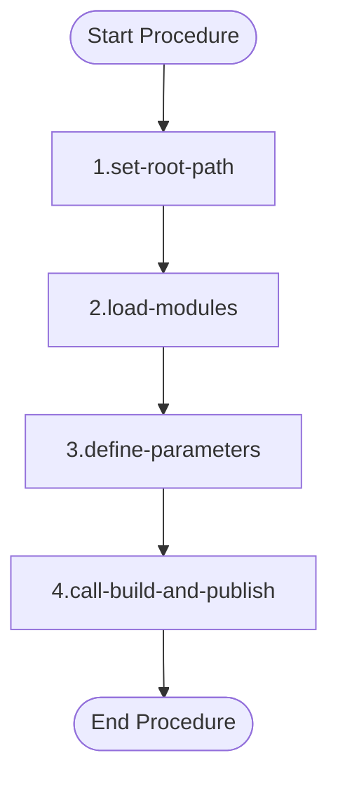
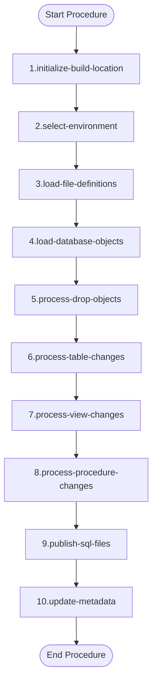
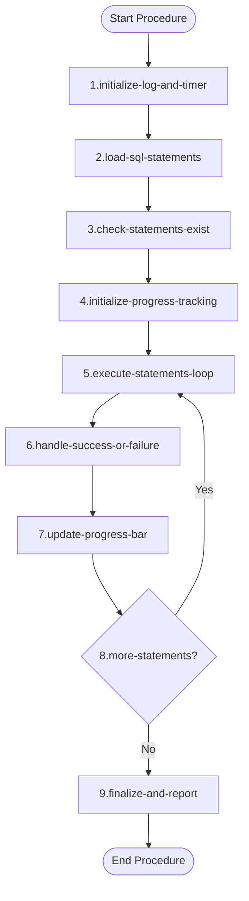

# Documentation: `deploy.ps1` [back](./../.framework.md)

## Overview

The `deploy.ps1` script serves as the entry point for deploying database objects (tables, views, and procedures) to a Teradata database environment. It loads required modules and delegates the actual build and publish process to the `ps_build_and_publish` function. It supports multiple environments and offers flexible deployment options via switches.

---

## Function: `deploy`

### Overview

The `deploy` function initializes the deployment process by setting up the root path, loading required modules, and passing deployment parameters to `ps_build_and_publish`. It acts as the orchestrator for the deployment pipeline.

### Input Parameters

| Technical Name | Functional Name | Description |
|---|---|---|
| `ip_cd_environment` | Environment Code | Target environment: `O` (Development), `T` (Test), `A` (Acceptance), `P` (Production) |
| `ip_publish` | Publish Switch | If provided, SQL statements from the BUILD-file are executed |
| `ip_excl_drop_objects` | Exclude Drop Objects | If provided, objects not in definitions will NOT be dropped |
| `ip_excl_tables` | Exclude Tables | If provided, table changes are ignored |
| `ip_excl_views` | Exclude Views | If provided, view changes are ignored |
| `ip_excl_procedrues` | Exclude Procedures | If provided, procedure changes are ignored |
| `ip_is_override` | Override Switch | If provided, all views and procedures are replaced regardless of their current state |

### Dependencies

| Dependency | Description |
|---|---|
| [`load_modules.ps1`](./../scripts/load_modules.ps1) | Loads all required PowerShell modules |
| [`ps_build_and_publish`](./../../scripts/ps_build_and_publish.ps1) | Core function that handles the build and publish process |

### Process Flow

<table>
<tr>
<th style="width:35%">Mermaid Diagram</th>
<th style="width:65%">Steps</th>
</tr>
<tr>
<td>

</td>
<td>

1. **Set Root Path**
   Sets `$global:fp_root` by stripping the deployment-specific suffix from the current script path (`$PSScriptRoot`), making the root of the project available globally.

2. **Load Modules**
   Executes `load_modules.ps1` using dot-sourcing (`.`), making all functions defined in the modules available in the current session.

3. **Define Parameters**
   Constructs a parameter hashtable (`$param`) containing all input parameters passed to the `deploy` function, preparing them for forwarding.

4. **Call `ps_build_and_publish`**
   Passes the collected parameters via splatting (`@param`) to `ps_build_and_publish`, which handles the actual comparison, build file generation, and optional publishing of SQL changes to the target database.

</td>
</tr>
</table>

---

## Function: `ps_build_and_publish`

### Overview

This is the core deployment function. It compares database object definitions from files against what is currently in the database, generates SQL build files for any differences, and optionally executes those SQL statements against the target database. It handles drops, table changes, view replacements, and procedure replacements.

### Input Parameters

| Technical Name | Functional Name | Description |
|---|---|---|
| `ip_cd_environment` | Environment Code | Target environment code used to select environment configuration |
| `ip_publish` | Publish Flag | If `$true`, executes generated SQL build files against the database |
| `ip_excl_drop_objects` | Exclude Drop Objects | If `$false`, objects in the database but not in definitions will be dropped |
| `ip_excl_tables` | Exclude Tables | If `$false`, table differences are processed |
| `ip_excl_views` | Exclude Views | If `$false`, view differences are processed |
| `ip_excl_procedrues` | Exclude Procedures | If `$false`, procedure differences are processed |
| `ip_is_override` | Override Flag | If `$true`, all views and procedures are replaced regardless of changes |

### Output

Returns `$true` if the process completes successfully. Exits with code `1` on critical failure.

### Dependencies

| Dependency | Description |
|---|---|
| [`ps_get_sql_file_inventory`](./../../scripts/ps_get_sql_file_inventory.ps1) | Retrieves object definitions from SQL files |
| [`ps_get_sql_objt_inventory`](./../../scripts/ps_get_sql_objt_inventory.ps1) | Retrieves current database object definitions |
| [`ps_generate_table_alter_script`](./../../scripts/ps_generate_table_alter_script.ps1) | Generates ALTER TABLE SQL statements |
| [`ps_minify_sql`](./../../scripts/ps_minify_sql.ps1) | Normalizes SQL for comparison |
| [`ps_publish`](./../../scripts/ps_publish.ps1) | Executes SQL build files against the database |
| [`ps_sql_connection`](./../../scripts/ps_sql_connection.ps1) | Creates a database connection |
| [`ps_exec_sql_non_query_statement`](./../../scripts/ps_exec_sql_non_query_statement.ps1) | Executes a non-query SQL statement |
| [`ps_log_error`](./../../scripts/ps_log_error.ps1) | Logs errors to the event log |

### Process Flow

<table>
<tr>
<th style="width:35%">Mermaid Diagram</th>
<th style="width:65%">Steps</th>
</tr>
<tr>
<td>

</td>
<td>

1. **Initialize Build Location**
   Creates (or clears) a build directory at `$fp_root\.framework\.deployment\.build\<environment>`. This folder will hold numbered SQL files to be executed. Also initializes the event log path.

2. **Select Environment**
   Looks up the environment configuration from `$environments` based on `ip_cd_environment`. Extracts key values such as `nm_database_target`, `nm_dsn`, and `ni_max_length_view`.

3. **Load File Definitions**
   Calls `ps_get_sql_file_inventory` to retrieve all SQL object definitions from the file system. If none are found, the process is aborted.

4. **Load Database Objects**
   Calls `ps_get_sql_objt_inventory` to retrieve the current state of objects from the target database. A warning is shown if no objects are found, but processing continues.

5. **Process Drop Objects**
   If `ip_excl_drop_objects` is `$false`, loops through all database objects. For any object not present in the file definitions, a `DROP` SQL statement is generated and saved as a numbered SQL file.

6. **Process Table Changes**
   If `ip_excl_tables` is `$false`, compares table definitions between files and database. Generates `CREATE TABLE` for new tables or calls `ps_generate_table_alter_script` for modified tables.

7. **Process View Changes**
   If `ip_excl_views` is `$false`, compares view SQL using `ps_minify_sql` to normalize whitespace. If differences exist (or override is active), the view definition is written as a numbered SQL file. A length check warns if the view text exceeds `ni_max_length_view` characters.

8. **Process Procedure Changes**
   If `ip_excl_procedrues` is `$false`, similarly compares procedures using `ps_minify_sql`. Changed or overridden procedures are written as numbered SQL files.

9. **Publish SQL Files**
   If `ip_publish` is `$true`, calls `ps_publish` to execute all generated SQL build files against the target database sequentially.

10. **Update Metadata**
    If any build files were generated (`$ni_build -ne 0`), calls the stored procedure `metadata_usp_load_metadata` via `ps_exec_sql_non_query_statement` to refresh database metadata. Final status is written to the console in green (success) or red (failure).

</td>
</tr>
</table>

---

## Function: `ps_publish`

### Overview

Executes the generated SQL build files against the target database, one statement at a time. Tracks progress, handles retries, and logs failures. Returns the number of failed statements.

### Input Parameters

| Technical Name | Functional Name | Description |
|---|---|---|
| `ip_fp_build` | Build Folder Path | Path to the folder containing the generated SQL build files |
| `ip_nm_dsn` | DSN Name | Data Source Name used to connect to the database |
| `ip_nm_database` | Database Name | Name of the database to connect to |

### Output

Returns `$ni_failed` — the number of SQL statements that failed to execute.

### Dependencies

| Dependency | Description |
|---|---|
| [`ps_get_sql_statements`](./../../scripts/ps_get_sql_statements.ps1) | Reads and parses SQL statements from the build folder |
| [`ps_sql_connection`](./../../scripts/ps_sql_connection.ps1) | Creates a database connection |
| [`ps_exec_sql_non_query_statement`](./../../scripts/ps_exec_sql_non_query_statement.ps1) | Executes a single SQL statement |
| [`ps_log_error`](./../../scripts/ps_log_error.ps1) | Logs errors to the event log |

### Process Flow

<table>
<tr>
<th style="width:35%">Mermaid Diagram</th>
<th style="width:65%">Steps</th>
</tr>
<tr>
<td>

</td>
<td>

1. **Initialize Log and Timer**
   Records the start time in `$global:dt_start` and creates an event log file in the build folder to capture execution details.

2. **Load SQL Statements**
   Calls `ps_get_sql_statements` to read and parse all SQL statements from the build folder into a collection.

3. **Check Statements Exist**
   If no SQL statements are found, a message is displayed and the function exits early with no further processing.

4. **Initialize Progress Tracking**
   Sets up a `$stats` hashtable tracking total, completed, pending, failed counts, and retry configuration (`mx_retry = 1`). Initializes two progress bars.

5. **Execute Statements Loop**
   Iterates over each SQL statement. For each, ensures a database connection exists via `ps_sql_connection`, then attempts execution via `ps_exec_sql_non_query_statement`.

6. **Handle Success or Failure**
   On success, increments `ni_done` and updates progress percentage. On failure, increments `ni_retry` and if retries are exhausted, increments `ni_failed` and logs the failure. On exceptions, calls `ps_log_error` and optionally reinitializes the connection for a retry.

7. **Update Progress Bar**
   After each statement, updates both progress bars showing elapsed time, statement counts, and the current build file being processed.

8. **More Statements?**
   Checks if there are remaining statements in the loop. If yes, continues to the next statement. If no, proceeds to finalization.

9. **Finalize and Report**
   Closes both progress bars and prints a summary showing how many statements succeeded and how many failed. Returns the total number of failed statements.

</td>
</tr>
</table>

---

**Utilized ASN GPT Prompt**

**LLM Used:** Claude (Anthropic)
**Prompt Used:** [level-1-powershell-script.txt](./../.ai_prompts/level-1-powershell-script.txt)

*end of document*
