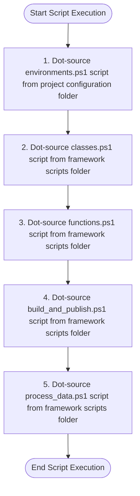

# Documentation: `.load_modules.ps1` [back](./../scripts.md)

## Brief Overview

This script initializes a PowerShell environment by loading configuration files and framework components. It sources four external scripts using dot-sourcing: environment configurations, class definitions, utility functions, and build/publish operations. The script establishes the foundation for a data engineering project by importing necessary modules and making their contents available in the current scope.

---

## Code NOT in Function

### Overview

This is the main execution block that dot-sources four PowerShell scripts. Dot-sourcing (using the `.` operator) executes scripts in the current scope, making all variables, functions, and classes available for subsequent use. The `-Raw` parameter is used but appears to be non-standard for dot-sourcing.

### Input Parameters

| Technical Name | Functional Name | Description |
| --- | --- | --- |
| `$global:fp_root` | Global Root File Path | Base directory path for the project structure |
| N/A | N/A | No other direct input parameters |

### Output Parameters

No explicit output parameters. The script loads configurations, classes, and functions into the current PowerShell session scope.

### Dependencies

- **External Script 1**: `$global:fp_root\project\.configuration\.environments.ps1`
  - Environment-specific configuration settings
  
- **External Script 2**: `$global:fp_root\.framework\.scripts\classes.ps1`
  - PowerShell class definitions
  
- **External Script 3**: `$global:fp_root\.framework\.scripts\functions.ps1`
  - Utility and helper functions
  
- **External Script 4**: `$global:fp_root\.framework\.scripts\build_and_publish.ps1`
  - Build and deployment automation functions
  
- **External Script 4**: `$global:fp_root\.framework\.scripts\process_data.ps1`
  - Handles the processing of data in the database

### Process Flow Diagram

---

**Utilized ASN GPT Prompt**

> **LLM Used:** Claude (Anthropic)
> **Prompt Used:** [level-1-powershell-script](./../.ai_prompts/documentation-related-to-powershell/level-1-powershell-script.tx)

*end of document*
