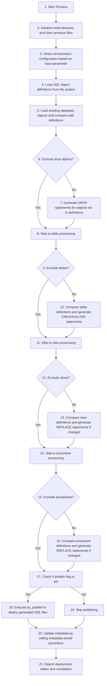
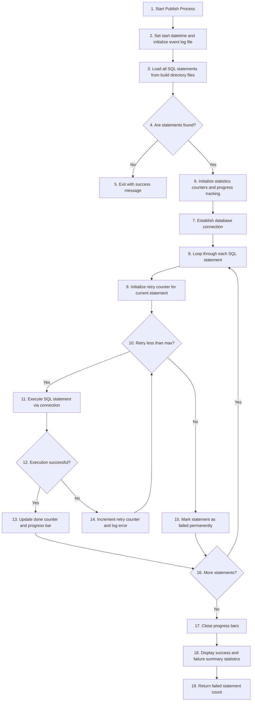

# Documentation `build_and_publish.ps1` [back](./../scripts.md)

## Brief Overview

This script automates database deployment for different environments (O/T/A/P). It compares SQL object definitions from files against actual database objects, generates ALTER/CREATE/DROP statements for tables, views, and procedures, and optionally executes these changes. The script maintains metadata and provides detailed logging of all deployment activities with progress tracking.

---

## Function: ps_build_and_publish

### Overview

Main orchestration function that builds deployment scripts by comparing file definitions with database objects, generates necessary SQL statements (CREATE, ALTER, DROP), and optionally publishes changes to the target database environment.

### Input Parameters

| Technical Name | Functional Name | Description |
| --- | --- | --- |
| `ip_cd_environment` | Environment Code | Mandatory parameter accepting O/T/A/P to specify target environment |
| `ip_publish` | Publish Flag | Switch to execute generated SQL scripts immediately |
| `ip_excl_drop_objects` | Exclude Drop Objects | Switch to skip generating DROP statements for obsolete objects |
| `ip_excl_tables` | Exclude Tables | Switch to skip table-related changes |
| `ip_excl_views` | Exclude Views | Switch to skip view-related changes |
| `ip_excl_procedures` | Exclude Procedures | Switch to skip procedure-related changes |
| `ip_is_override` | Override Flag | Switch to force replacement of all views/procedures regardless of changes |

### Output Parameters

Returns boolean indicating successful metadata update and sets `$ni_failed` variable with count of failed deployments.

### Dependencies

- `ps_get_sql_file_inventory` - Loads SQL definitions from files
- `ps_get_sql_objt_inventory` - Retrieves database objects
- `ps_generate_table_alter_script` - Creates ALTER TABLE statements
- `ps_minify_sql` - Normalizes SQL for comparison
- `ps_publish` - Executes deployment scripts
- `ps_sql_connection` - Establishes database connection
- `ps_exec_sql_non_query_statement` - Executes SQL statements
- `ps_log_error` - Error logging functionality

### Process Flow

---

## Function: ps_publish

### Overview

Executes SQL deployment scripts from build directory in sequential order. Provides progress tracking, retry logic for failed statements, and comprehensive error logging for all deployment activities.

### Input Parameters

| Technical Name | Functional Name | Description |
| --- | --- | --- |
| `ip_fp_build` | Build Folder Path | Mandatory path to directory containing generated SQL scripts |
| `ip_nm_dsn` | DSN Name | Mandatory data source name for database connection |
| `ip_nm_database` | Database Name | Mandatory target database name for execution |

### Output Parameters

Returns integer count of failed SQL statement executions (`$stats.ni_failed`).

### Dependencies

- `ps_get_sql_statements` - Reads SQL files from build directory
- `ps_sql_connection` - Creates database connection
- `ps_exec_sql_non_query_statement` - Executes individual SQL statements
- `ps_log_error` - Logs execution errors
- `Write-Progress` - PowerShell cmdlet for progress display

### Process Flow

---

## Code Outside Functions

No executable code exists outside the function definitions in this script. All logic is encapsulated within the two functions described above.

---

**Utilized ASN GPT Prompt**

> **LLM Used:** Claude (Anthropic)
> **Prompt Used:** [level-1-powershell-script](./../.ai_prompts/documentation-related-to-powershell/level-1-powershell-script.tx)

*end of document*
