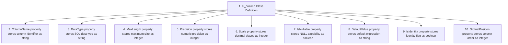
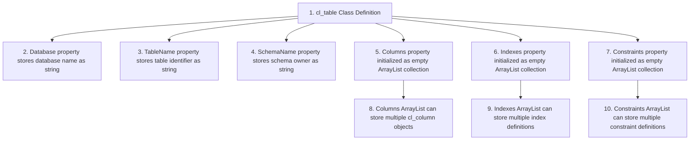

# Documentation `nuild_and_publish.ps1` [back](./../scripts.md)

## Brief Overview

This script defines three PowerShell classes used as data structures for representing database schema objects. The classes model database columns, tables with their metadata, and provide a structured way to store and manipulate database schema information programmatically within PowerShell scripts.

---

## Class: cl_column

### Overview

Represents a single database column with its complete metadata including data type, nullability, identity properties, and position information. Used to store column definitions when comparing or creating database schemas.

### Properties

| Technical Name | Functional Name | Description |
| --- | --- | --- |
| `ColumnName` | Column Name | String containing the name of the database column |
| `DataType` | Data Type | String specifying the column's data type (e.g., VARCHAR, INT) |
| `MaxLength` | Maximum Length | Integer defining maximum character/byte length for the column |
| `Precision` | Numeric Precision | Integer specifying total number of digits for numeric types |
| `Scale` | Numeric Scale | Integer specifying number of decimal places for numeric types |
| `IsNullable` | Nullable Flag | Boolean indicating if column accepts NULL values |
| `DefaultValue` | Default Value | String containing the default value expression for the column |
| `IsIdentity` | Identity Flag | Boolean indicating if column is an auto-incrementing identity column |
| `OrdinalPosition` | Column Position | Integer representing the column's order within the table |

### Dependencies

- None (native PowerShell class)

### Structure Diagram

---

## Class: cl_table

### Overview

Represents a complete database table structure including schema, name, and collections of columns, indexes, and constraints. Serves as container object for full table metadata during schema operations.

### Properties

| Technical Name | Functional Name | Description |
| --- | --- | --- |
| `Database` | Database Name | String containing the database name where table resides |
| `TableName` | Table Name | String containing the name of the database table |
| `SchemaName` | Schema Name | String containing the schema/owner name of the table |
| `Columns` | Columns Collection | ArrayList storing cl_column objects representing table columns |
| `Indexes` | Indexes Collection | ArrayList storing index definitions for the table |
| `Constraints` | Constraints Collection | ArrayList storing constraint definitions (PK, FK, CHECK, etc.) |

### Dependencies

- `System.Collections.ArrayList` - .NET collection type for dynamic arrays

### Structure Diagram

---

## Code Outside Classes

### Overview

No executable code exists outside the class definitions. This script contains only class declarations that define data structures for use by other PowerShell scripts.

### Input Parameters

Not applicable - no executable code present.

### Output Parameters

Not applicable - no executable code present.

### Dependencies

Not applicable - only class definitions present.

---

**Utilized ASN GPT Prompt**

> **LLM Used:** Claude (Anthropic)
> **Prompt Used:** [level-1-powershell-script](./../.ai_prompts/documentation-related-to-powershell/level-1-powershell-script.tx)

*end of document*
