# Documentation `functions.ps1` [back](./../scripts.md)

## Brief Overview

This script automates SQL database deployment and management for Teradata environments. It reads SQL definitions from files, compares them with existing database objects, generates ALTER scripts for schema changes, and executes deployments. The script handles table structure modifications, manages credentials securely, and provides progress tracking throughout the deployment process.

---

## Functions

### 1. `ps_get_sql_file_inventory`

#### Overview

Scans specified folders for SQL files, reads their content, processes environment variables, and builds a structured inventory of SQL objects (tables, views, procedures) with their definitions and metadata.

#### Input Parameters

| Technical Name | Functional Name | Description |
| --- | --- | --- |
| `ip_nm_database_target` | Target Database Name | The database where objects will be deployed |
| `ip_environment` | Environment Configuration | Object containing environment-specific settings (cd_environment, nm_environment, nm_database, parameters) |

#### Output Parameters

Returns an array of PSCustomObjects containing:

- `ni_ordering`: Sequential order number
- `fp_relative`: Relative file path
- `nm_grouping`: Grouping category from folder structure
- `nm_schema`: Schema name extracted from path
- `nm_object`: Object name
- `cd_type`: Object type (tables/views/procedures)
- `tx_object`: SQL statement text
- `ob_table`: Table definition object (for tables only)
- `dt_modified`: Last modification timestamp

#### Dependencies

- `ps_remove_comments` - Removes SQL comments from statements
- `ps_get_table_def_from_sql_statement` - Parses CREATE TABLE statements
- Global variable: `$global:fp_root` - Root folder path

#### Process Flow

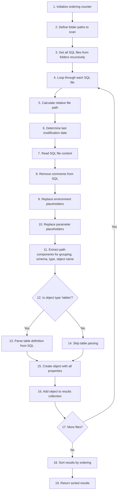

---

### 2. `ps_get_sql_objt_inventory`

#### Overview

Queries the Teradata database to retrieve existing objects (tables, views, procedures), compares modification dates with local definitions, and builds an inventory using either database metadata or local file definitions based on which is newer.

#### Input Parameters

| Technical Name | Functional Name | Description |
| --- | --- | --- |
| `ip_nm_database_target` | Target Database Name | Database to query for existing objects |
| `ip_nm_dsn` | Data Source Name | ODBC DSN for database connection |
| `ip_environment` | Environment Configuration | Environment settings object |
| `ip_excl_tables` | Exclude Tables Flag | Boolean to exclude tables from inventory |
| `ip_excl_views` | Exclude Views Flag | Boolean to exclude views from inventory |
| `ip_excl_procedures` | Exclude Procedures Flag | Boolean to exclude stored procedures from inventory |
| `ip_objects_tx` | Text Objects Collection | Collection of objects from file inventory |

#### Output Parameters

Returns an array of PSCustomObjects with the same structure as `ps_get_sql_file_inventory`.

#### Dependencies

- `ps_sql_connection` - Establishes database connection
- `ps_exec_sql_query_statement` - Executes SQL queries
- `ps_get_table_def_from_sql_database` - Retrieves table structure from database
- Write-Progress (PowerShell built-in) - Displays progress bars

#### Process Flow

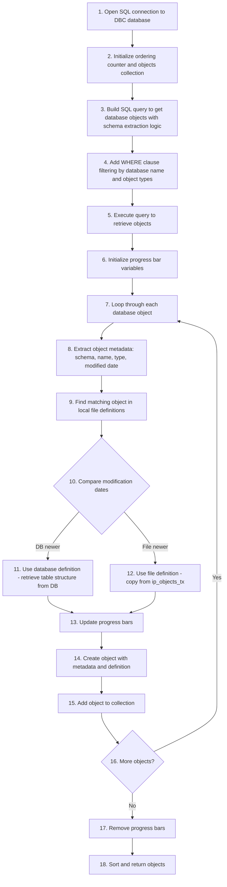

---

### 3. `ps_generate_table_alter_script`

#### Overview

Generates a four-step ALTER script sequence for modifying table structures: rename existing table, recreate with new structure, copy data with type conversions, and drop old table. Validates that data type conversions are safe before generating scripts.

#### Input Parameters

| Technical Name | Functional Name | Description |
| --- | --- | --- |
| `ip_ob_table_db` | Database Table Object | Current table structure from database |
| `ip_ob_table_tx` | Text Table Object | Desired table structure from file |
| `ip_nm_database_target` | Target Database Name | Database containing the table |
| `ip_nm_schema` | Schema Name | Schema of the table |
| `ip_nm_table` | Table Name | Name of the table |
| `ip_ni_build` | Build Number | Sequential number for script ordering |
| `ip_fp_build` | Build Folder Path | Folder path for output scripts |

#### Output Parameters

Generates four SQL script files:

- `{build}-A-Rename-{table}-to-{table}_renamed.sql`
- `{build}-B-(Re)deploy-{table}.sql`
- `{build}-C-Load-existing-Data-into-{table}.sql`
- `{build}-D-Drop-Renamed-Table-{table}_renamed.sql`

#### Dependencies

- `ps_assesment_of_conversion` - Validates data type conversions
- Out-File (PowerShell built-in) - Writes scripts to files

#### Process Flow

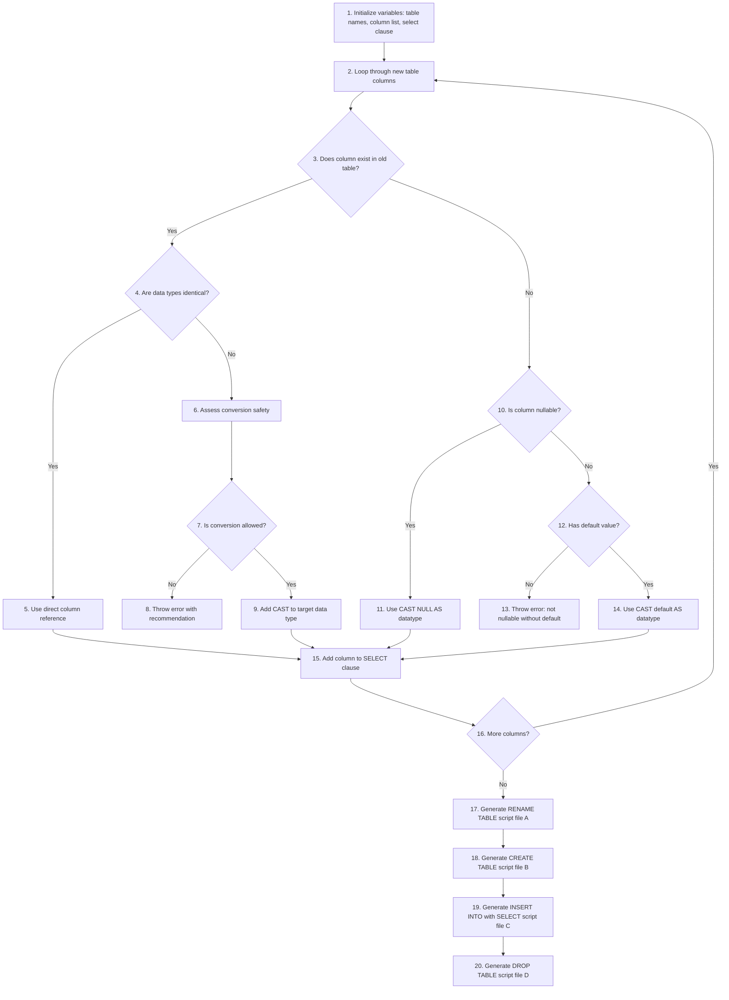

---

### 4. `get_credentials`

#### Overview

Manages secure credential storage and retrieval for database connections. Prompts for credentials on first use or when requested, encrypts and stores them in user profile, and retrieves stored credentials for subsequent use.

#### Input Parameters

| Technical Name | Functional Name | Description |
| --- | --- | --- |
| `ip_prompt_for_override` | Prompt Override Flag | "y" to prompt for re-entering credentials, otherwise use stored |

#### Output Parameters

Returns a `PSCredential` object containing encrypted username and password.

#### Dependencies

- Export-Clixml (PowerShell built-in) - Encrypts and exports credentials
- Import-Clixml (PowerShell built-in) - Imports encrypted credentials
- Read-Host (PowerShell built-in) - Prompts for user input
- Environment variable: `$env:USERPROFILE` - User profile directory

#### Process Flow

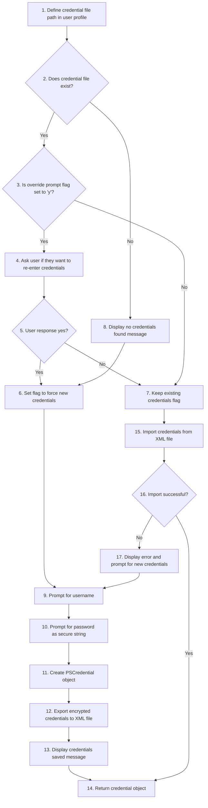

---

### 5. `ps_sql_connection`

#### Overview

Establishes a connection to a Teradata database using ODBC with retry logic. Retrieves credentials securely, builds connection string, and attempts connection up to three times with progressive delays on failure.

#### Input Parameters

| Technical Name | Functional Name | Description |
| --- | --- | --- |
| `ip_nm_dsn` | Data Source Name | ODBC DSN name configured for Teradata |
| `ip_nm_database` | Database Name | Initial database to connect to |

#### Output Parameters

Returns an open `OdbcConnection` object ready for executing queries.

#### Dependencies

- `get_credentials` - Retrieves database credentials
- System.Data.Odbc.OdbcConnection (.NET class) - ODBC connection object
- Start-Sleep (PowerShell built-in) - Delays between retries

#### Process Flow

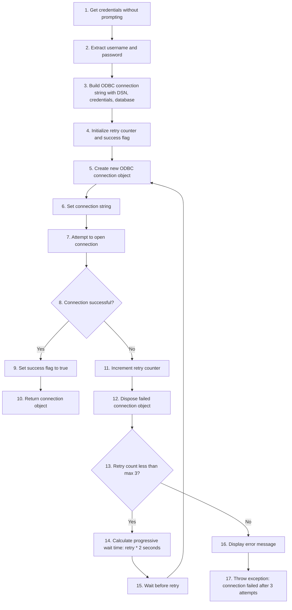

---

### 6. `ps_sql_command`

#### Overview

Creates a configured SQL command object from a connection and SQL text. Sets command type to Text, disables timeout for long-running queries, and prepares the command for execution.

#### Input Parameters

| Technical Name | Functional Name | Description |
| --- | --- | --- |
| `ip_ob_sql_connection` | SQL Connection Object | Open ODBC connection |
| `ip_tx_sql` | SQL Statement Text | SQL query or command to execute |

#### Output Parameters

Returns an `OdbcCommand` object configured and ready for execution.

#### Dependencies

- OdbcConnection.CreateCommand() method - Creates command from connection

#### Process Flow

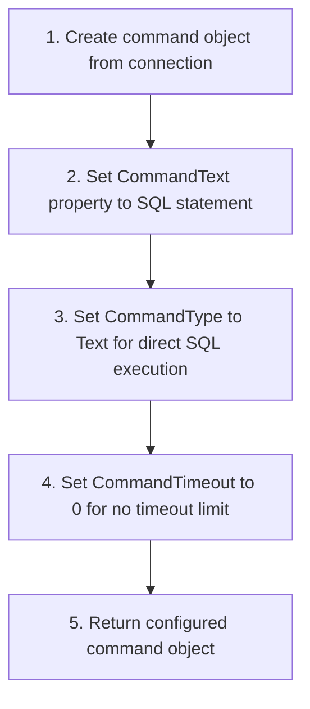

---

### 7. `ps_exec_sql_query_statement`

#### Overview

Executes a SQL query and returns results as a DataTable. Implements retry logic with automatic reconnection on failure. Uses data adapters to efficiently fill datasets with query results.

#### Input Parameters

| Technical Name | Functional Name | Description |
| --- | --- | --- |
| `ip_ob_sql_connection` | SQL Connection Object | Open ODBC connection |
| `ip_tx_sql` | SQL Query Text | SELECT query to execute |
| `ip_nm_dsn` | Data Source Name | DSN for reconnection attempts |

#### Output Parameters

Returns a `DataTable` containing query results with columns and rows.

#### Dependencies

- `ps_sql_command` - Creates command object
- `ps_sql_connection` - Reconnects on failure
- System.Data.Odbc.OdbcDataAdapter (.NET class) - Executes query and fills dataset
- System.Data.DataSet (.NET class) - Holds query results

#### Process Flow

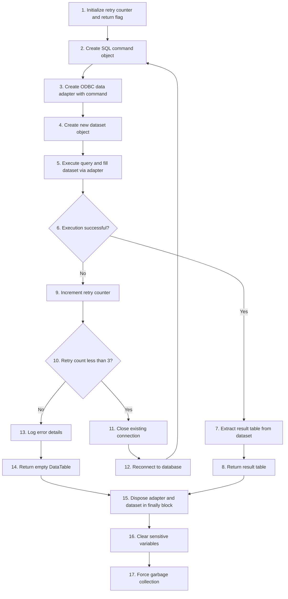

---

### 8. `ps_exec_sql_non_query_statement`

#### Overview

Executes SQL statements that don't return results (INSERT, UPDATE, DELETE, CREATE, DROP). Implements three-attempt retry logic with automatic reconnection on failure and error logging.

#### Input Parameters

| Technical Name | Functional Name | Description |
| --- | --- | --- |
| `ip_nm_dsn` | Data Source Name | DSN for reconnection |
| `ip_ob_sql_connection` | SQL Connection Object | Open ODBC connection |
| `ip_tx_sql` | SQL Statement Text | DML/DDL statement to execute |

#### Output Parameters

Returns boolean: `$true` if execution succeeded, `$false` if failed after retries.

#### Dependencies

- `ps_sql_command` - Creates command object
- `ps_log_error` - Logs errors to file
- `ps_sql_connection` - Reconnects on failure
- Global variable: `$Global:fp_event_log` - Event log file path

#### Process Flow

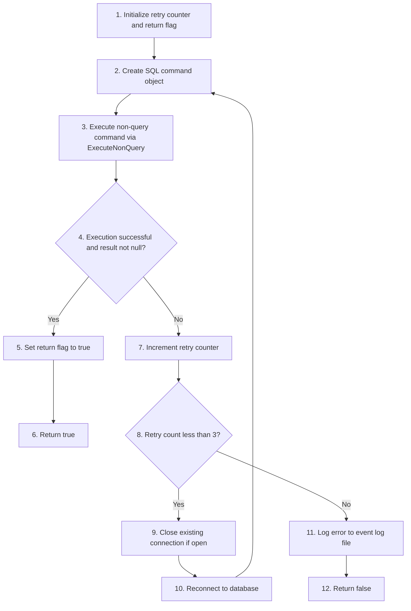

---

### 9. `ps_remove_comments`

#### Overview

Removes SQL comments (single-line `--` and multi-line `/* */`) from SQL statements while preserving comments inside quoted strings. Cleans up excessive blank lines for readable output.

#### Input Parameters

| Technical Name | Functional Name | Description |
| --- | --- | --- |
| `ip_tx_sql_statement` | SQL Statement Text | SQL text containing comments |

#### Output Parameters

Returns cleaned SQL text string with comments removed.

#### Dependencies

- None (uses PowerShell built-in string operations and regex)

#### Process Flow

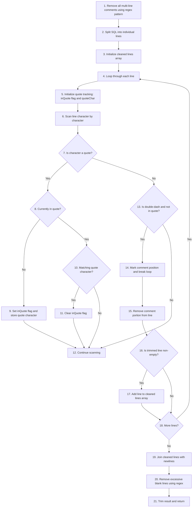

---

### 10. `ps_minify_sql`

#### Overview

Compresses SQL statements by removing comments, extra whitespace, and line breaks while preserving string literals. Optionally keeps newlines after major keywords for readability. Reduces SQL file size for storage or transmission.

#### Input Parameters

| Technical Name | Functional Name | Description |
| --- | --- | --- |
| `SqlQuery` | SQL Query Text | SQL statement to minify (accepts pipeline input) |
| `PreserveComments` | Keep Comments Flag | Switch to retain comments in output |
| `KeepNewlinesAfterKeywords` | Format Keywords Flag | Switch to add newlines after major SQL keywords |

#### Output Parameters

Returns minified SQL text string.

#### Dependencies

- None (uses PowerShell built-in regex and string operations)

#### Process Flow

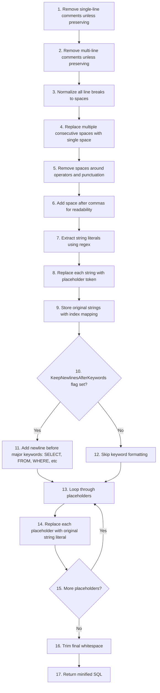

---

### 11. `ps_log_error`

#### Overview

Formats and logs detailed error information to a file. Captures exception message, type, stack trace, line number, and SQL statement. Optionally displays error on console.

#### Input Parameters

| Technical Name | Functional Name | Description |
| --- | --- | --- |
| `ip_fp_event_log` | Event Log File Path | Full path to error log file |
| `ip_tx_sql_statement` | SQL Statement Text | SQL that caused the error |
| `ip_feedback` | Display Feedback Switch | Switch to display error on console |

#### Output Parameters

None (writes to file and optionally to console).

#### Dependencies

- Out-File (PowerShell built-in) - Appends to log file
- Automatic variable: `$_` - Current error object

#### Process Flow

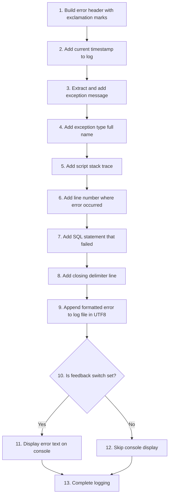

---

### 12. `ps_get_sql_statements`

#### Overview

Reads all SQL files from a build folder recursively, loads their content, and returns a collection of statements with metadata. Used to load generated deployment scripts for execution.

#### Input Parameters

| Technical Name | Functional Name | Description |
| --- | --- | --- |
| `ip_fp_build` | Build Folder Path | Folder containing SQL script files |

#### Output Parameters

Returns array of PSCustomObjects with properties:

- `tx_sql`: SQL statement text
- `fp_build`: File base name without extension

#### Dependencies

- Test-Path (PowerShell built-in) - Validates folder exists
- Get-ChildItem (PowerShell built-in) - Lists SQL files
- Get-Content (PowerShell built-in) - Reads file content

#### Process Flow

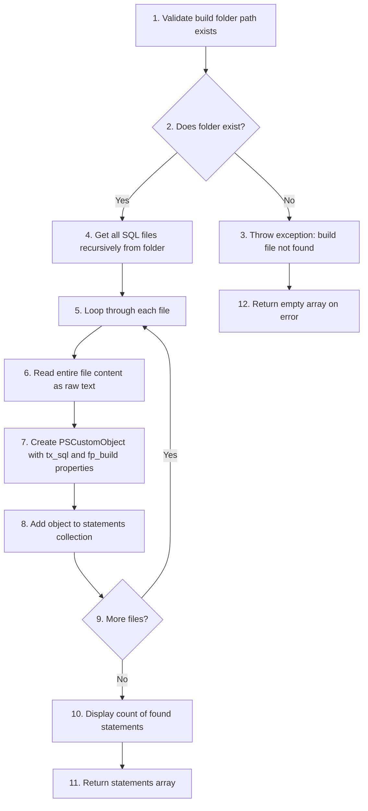

---

### 13. `ps_exec_sql_query_to_file`

#### Overview

Streams SQL query results directly to a file row-by-row to handle large datasets efficiently. Supports custom delimiters, encoding, headers, and row numbering. Displays progress every 10,000 rows.

#### Input Parameters

| Technical Name | Functional Name | Description |
| --- | --- | --- |
| `ip_ob_sql_connection` | SQL Connection Object | Open ODBC connection |
| `ip_tx_sql` | SQL Query Text | SELECT query to execute |
| `ip_nm_dsn` | Data Source Name | DSN for reconnection |
| `ip_output_file` | Output File Path | Full path for result file |
| `ip_delimiter` | Column Delimiter | Delimiter between columns (default: pipe) |
| `ip_encoding` | File Encoding | Text encoding (default: UTF8) |
| `ip_include_headers` | Include Headers Flag | Boolean to include column headers (default: true) |
| `ip_add_row_number` | Add Row Number Flag | Boolean to prefix rows with number (default: true) |

#### Output Parameters

Creates a delimited text file with query results.

#### Dependencies

- `ps_sql_command` - Creates command object
- `ps_sql_connection` - Reconnects on failure
- System.IO.StreamWriter (.NET class) - Efficient file writing
- OdbcCommand.ExecuteReader() method - Streams results

#### Process Flow

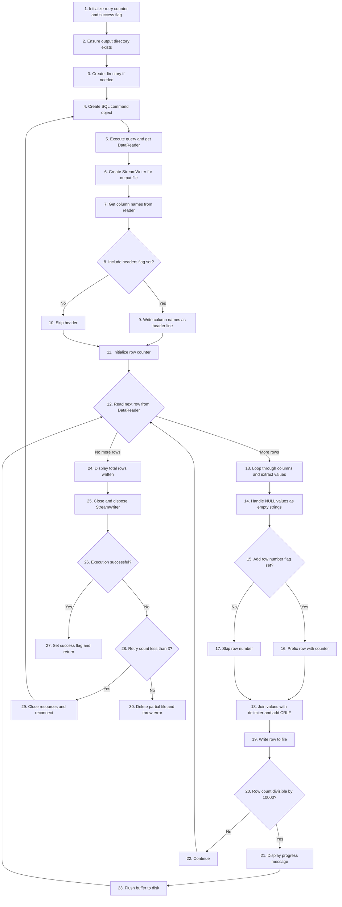

---

### 14. `ps_get_table_def_from_sql_statement`

#### Overview

Parses a CREATE TABLE SQL statement using regex to extract table structure including columns, data types, lengths, precision, scale, nullability, defaults, and ordinal positions. Builds a structured table definition object.

#### Input Parameters

| Technical Name | Functional Name | Description |
| --- | --- | --- |
| `ip_tx_sql_statement` | SQL Statement Text | CREATE TABLE statement to parse |
| `ip_nm_database` | Database Name | Target database name |
| `ip_nm_schema` | Schema Name | Schema name |
| `ip_nm_table` | Table Name | Table name |

#### Output Parameters

Returns a `cl_table` object containing:

- `Database`: Database name
- `SchemaName`: Schema name
- `TableName`: Table name
- `Columns`: ArrayList of `cl_column` objects with full column definitions

#### Dependencies

- Class definitions: `cl_table`, `cl_column`
- Regex (.NET) - Pattern matching for SQL parsing

#### Process Flow

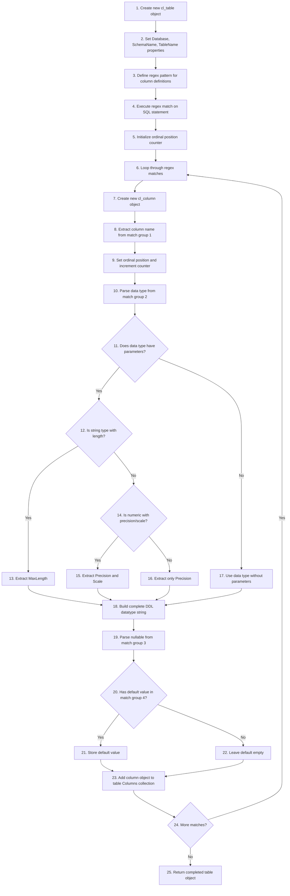

---

### 15. `ps_get_table_def_from_sql_database`

#### Overview

Queries Teradata system tables (DBC.ColumnsV) to retrieve complete table structure metadata including all columns with their data types, lengths, precision, scale, nullability, defaults, and ordinal positions.

#### Input Parameters

| Technical Name | Functional Name | Description |
| --- | --- | --- |
| `ip_ob_sql_connection` | SQL Connection Object | Open ODBC connection |
| `ip_nm_database` | Database Name | Target database name |
| `ip_nm_schema` | Schema Name | Schema name |
| `ip_nm_table` | Table Name | Table name |
| `ip_nm_dsn` | Data Source Name | DSN for query execution |

#### Output Parameters

Returns a `cl_table` object with complete column definitions from database metadata.

#### Dependencies

- `ps_exec_sql_query_statement` - Executes metadata query
- Class definitions: `cl_table`, `cl_column`

#### Process Flow

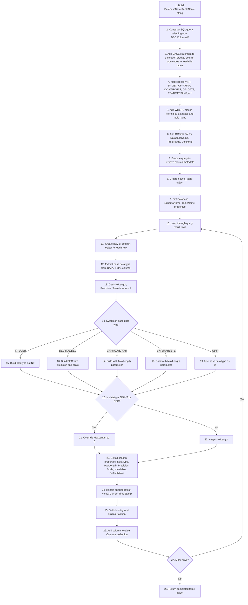

---

### 16. `ps_assesment_of_conversion`

#### Overview

Evaluates whether converting from one SQL data type to another is safe, allowed, or risky. Analyzes precision, scale, and length changes for numeric, string, and datetime types. Provides detailed risk assessment and recommendations.

#### Input Parameters

| Technical Name | Functional Name | Description |
| --- | --- | --- |
| `ip_source_datatype` | Source Data Type Object | Object with datatype, maxlength, precision, scale properties |
| `ip_target_datatype` | Target Data Type Object | Object with target datatype parameters |

#### Output Parameters

Returns a PSCustomObject with properties:

- `IsAllowed`: Boolean indicating if conversion is permitted
- `ConversionType`: Type category (SameType/Safe/Risky/Incompatible)
- `RiskLevel`: None/Low/Medium/High/Blocked
- `RequiresDataValidation`: Boolean if data validation needed
- `PotentialIssues`: Array of issue descriptions
- `Recommendation`: Suggested action or alternative approach
- `PrecisionScaleCheck`: Status of precision/scale validation
- `LengthCheck`: Status of length validation
- `SourceDefinition`: Full source datatype string
- `TargetDefinition`: Full target datatype string

#### Dependencies

- Helper function: `Test-PrecisionScaleChange` - Validates precision/scale changes
- Helper function: `Test-PrecisionChange` - Validates datetime precision changes
- Helper function: `Get-DatatypeDefinition` - Formats datatype strings

#### Process Flow

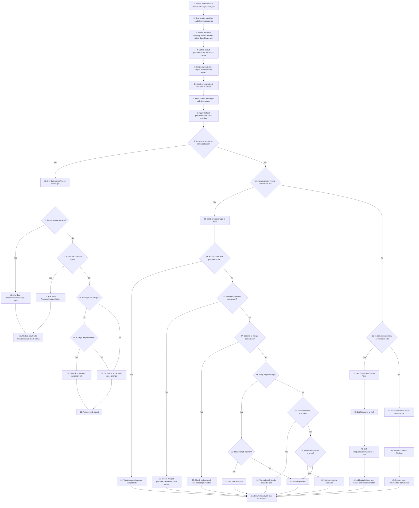

---

### Helper Function: `Test-PrecisionScaleChange`

#### Overview

Validates precision and scale changes for DECIMAL/NUMERIC types. Calculates whole number digits, detects truncation risks, checks for overflows, and provides detailed recommendations for safe conversions.

#### Input Parameters

| Technical Name | Functional Name | Description |
| --- | --- | --- |
| `SourcePrecision` | Source Precision | Total digits in source |
| `SourceScale` | Source Scale | Decimal places in source |
| `TargetPrecision` | Target Precision | Total digits in target |
| `TargetScale` | Target Scale | Decimal places in target |
| `DataType` | Data Type Name | Type being converted (decimal/numeric) |

#### Output Parameters

Returns hashtable with:

- `Status`: Description of change type
- `RiskLevel`: None/Low/Medium/High/Blocked
- `RequiresValidation`: Boolean
- `Issues`: Array of issue descriptions
- `Recommendation`: Suggested action

#### Process Flow

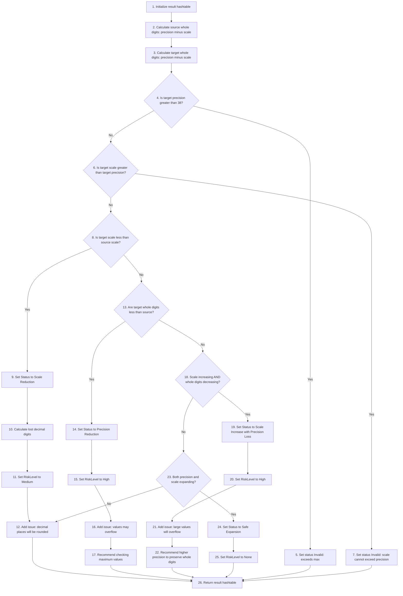

---

### Helper Function: `Test-PrecisionChange`

#### Overview

Validates precision changes for datetime types (DATETIME2, DATETIMEOFFSET, TIME). Checks maximum allowed precision (7) and assesses impact of reducing fractional seconds precision.

#### Input Parameters

| Technical Name | Functional Name | Description |
| --- | --- | --- |
| `SourcePrecision` | Source Precision | Fractional seconds digits in source |
| `TargetPrecision` | Target Precision | Fractional seconds digits in target |
| `DataType` | Data Type Name | Datetime type being converted |

#### Output Parameters

Returns hashtable with:

- `Status`: Description of change
- `RiskLevel`: None/Low/Blocked
- `RequiresValidation`: Boolean
- `Issues`: Array of issues

#### Process Flow

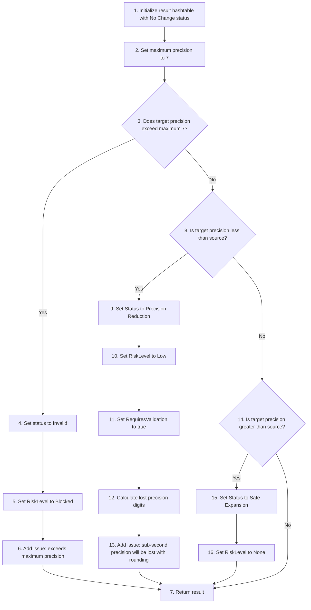

---

### Helper Function: `Get-DatatypeDefinition`

#### Overview

Formats a datatype with its parameters (length, precision, scale) into a complete DDL-ready string representation. Handles string types, numeric types, and datetime types appropriately.

#### Input Parameters

| Technical Name | Functional Name | Description |
| --- | --- | --- |
| `DataType` | Data Type Name | Base datatype name |
| `Length` | Length Parameter | Length for string/binary types |
| `Precision` | Precision Parameter | Precision for numeric/datetime types |
| `Scale` | Scale Parameter | Scale for numeric types |

#### Output Parameters

Returns formatted datatype string (e.g., "VARCHAR(100)", "DECIMAL(18,2)", "DATETIME2(7)").

#### Process Flow

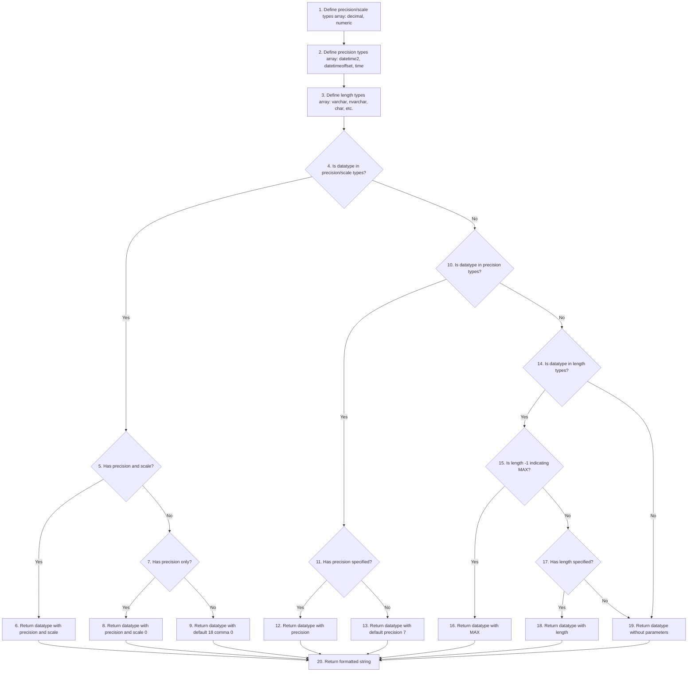

---

## Code Outside Functions

### Overview

The main execution code handles the complete deployment workflow: loads configurations, builds object inventories from files and database, compares structures, generates ALTER scripts for changed tables, and optionally executes the deployment. Provides user prompts for credential management and deployment confirmation.

### Input Parameters

This code uses predefined configuration variables and prompts the user for deployment confirmation. Key inputs:

| Technical Name | Functional Name | Description |
| --- | --- | --- |
| (User prompt) | Credential Override | User confirms whether to re-enter database credentials |
| (User prompt) | Deployment Confirmation | User confirms whether to execute generated SQL scripts |
| `$global:fp_root` | Root Folder Path | Base directory containing SQL definitions |
| `$ip_environment` | Environment Configuration | Environment settings loaded from configuration |

### Output Parameters

The code produces:

- Build folder with numbered SQL deployment scripts
- Event log file with execution details
- Console output showing progress and results
- Deployed database objects (if execution confirmed)

### Dependencies

- All functions defined earlier in the script
- Global variables: `$global:fp_root`, `$global:fp_event_log`
- Configuration file: "teradata_config.json" (assumed to exist)

### Process Flow

```mermaid
flowchart TD
    A[1. Prompt user to re-enter database credentials] --> B[2. Call get_credentials function]
    B --> C[3. Define target database name from configuration]
    C --> D[4. Set exclusion flags for tables, views, procedures]
    D --> E[5. Define build folder path with timestamp]
    E --> F[6. Create build directory if not exists]
    F --> G[7. Define event log file path]
    G --> H[8. Display deployment start message with timestamp]
    H --> I[9. Call ps_get_sql_file_inventory to load SQL definitions from files]
    I --> J[10. Display count of found SQL file objects]
    J --> K[11. Open database connection via ps_sql_connection]
    K --> L[12. Call ps_get_sql_objt_inventory to load database objects]
    L --> M[13. Display count of found database objects]
    M --> N[14. Initialize build script counter]
    N --> O[15. Loop through file inventory objects]
    O --> P{16. Is object type tables?}
    P -->|Yes| Q[17. Find matching object in database inventory]
    Q --> R{18. Database object found?}
    R -->|Yes| S[19. Compare file and database table structures]
    S --> T{20. Are structures different?}
    T -->|Yes| U[21. Display table has changes message]
    U --> V[22. Increment build counter]
    V --> W[23. Call ps_generate_table_alter_script]
    W --> X[24. Catch and display any errors]
    T -->|No| Y[25. Display table unchanged message]
    R -->|No| Z[26. Display table is new message]
    Z --> AA[27. Increment build counter]
    AA --> AB[28. Write CREATE TABLE script to build folder]
    P -->|No| AC{29. Is object type views or procedures?}
    AC -->|Yes| AD[30. Increment build counter]
    AD --> AE[31. Write CREATE VIEW/PROCEDURE script to build folder]
    AC -->|No| AF[32. Skip object]
    Y --> AG{33. More objects in file inventory?}
    X --> AG
    AB --> AG
    AE --> AG
    AF --> AG
    AG -->|Yes| O
    AG -->|No| AH[34. Display build generation complete message]
    AH --> AI[35. Call ps_get_sql_statements to load generated scripts]
    AI --> AJ[36. Display count of found SQL statements]
    AJ --> AK[37. Prompt user: Execute deployment yes or no?]
    AK --> AL{38. User confirmed deployment?}
    AL -->|Yes| AM[39. Display execution start message]
    AM --> AN[40. Loop through SQL statements]
    AN --> AO[41. Display executing script message]
    AO --> AP[42. Call ps_exec_sql_non_query_statement]
    AP --> AQ{43. Execution successful?}
    AQ -->|Yes| AR[44. Display success message]
    AQ -->|No| AS[45. Display failure message and log error]
    AR --> AT{46. More statements?}
    AS --> AT
    AT -->|Yes| AN
    AT -->|No| AU[47. Display deployment complete message]
    AL -->|No| AV[48. Display deployment cancelled message]
    AU --> AW[49. Close database connection]
    AV --> AW
    AW --> AX[50. Display script end timestamp]
```

---

**Utilized ASN GPT Prompt**

> **LLM Used:** Claude (Anthropic)
> **Prompt Used:** [level-1-powershell-script](./../.ai_prompts/documentation-related-to-powershell/level-1-powershell-script.tx)

*end of document*
