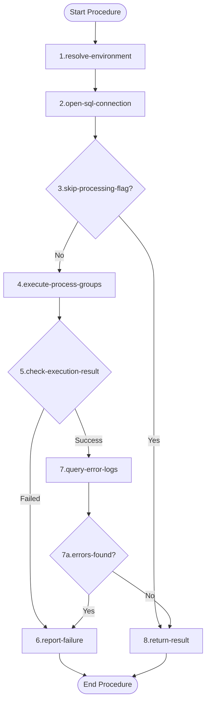

# Documentation `process_data.ps1` [back](./../scripts.md)

## Brief Overview

The script processes data for a specified environment by executing SQL stored procedures that handle ingestion, transformation, and preparation of CSV data. It connects to a database, runs a processing group procedure, and checks the logging table for errors. If errors are found, it reports them and halts execution.

---

## Function: `ps_process_data`

### Overview

This function orchestrates the full data processing pipeline for a given environment. It establishes a database connection, triggers all process groups, and validates the outcome by querying the logging table for errors.

---

### Input Parameters

| Technical Name | Functional Name | Description |
| --- | --- | --- |
| `$ip_cd_environment` | Environment Code | Specifies the target environment. Accepted values: `O`, `T`, `A`, `P` (e.g., Acceptance, Production) |
| `$ip_skip_processing_data` | Skip Processing Flag | When provided as a switch, skips the data ingestion, transformation and preparation steps entirely |

---

### Output Parameter

| Technical Name | Functional Name | Description |
| --- | --- | --- |
| `$result` | Processing Result | Returns `$true` if processing succeeded, `$false` if an error occurred |

---

### Dependencies

| Name | Type | Reference |
| --- | --- | --- |
| `ps_sql_connection` | Function | Internal function — opens a SQL connection based on DSN and database name |
| `ps_exec_sql_non_query_statement` | Function | Internal function — executes a non-query SQL statement (e.g., CALL/stored procedure) |
| `ps_exec_sql_query_statement` | Function | Internal function — executes a SQL query and returns result rows |
| `$environments` | Variable | External/global variable — holds environment configuration including DSN and parameters |
| [`Write-Host`](https://learn.microsoft.com/en-us/powershell/module/microsoft.powershell.utility/write-host) | PowerShell Cmdlet | Outputs messages to the console |
| [`Format-List`](https://learn.microsoft.com/en-us/powershell/module/microsoft.powershell.utility/format-list) | PowerShell Cmdlet | Displays object properties in a list format |
| [`Exit-PSHostProcess`](https://learn.microsoft.com/en-us/powershell/module/microsoft.powershell.core/exit-pshostprocess) | PowerShell Cmdlet | Terminates the current PowerShell host process |
| [`Where-Object`](https://learn.microsoft.com/en-us/powershell/module/microsoft.powershell.core/where-object) | PowerShell Cmdlet | Filters objects from a collection based on a condition |

---

### Process Flow Diagram

<table>
<tr>
<th style="width:35%; text-align: left; vertical-align: top;">Mermaid Diagram</th>
<th style="width:65%; text-align: left; vertical-align: top;">Logical / Functional Steps</th>
</tr>
<tr>
<td>

</td>
<td>

1. **Resolve Environment**
   Looks up the environment configuration from the global `$environments`-variable using the provided environment code (`$ip_cd_environment`). Extracts the target database name (`nm_database_target`) and DSN (`nm_dsn`) from the environment's parameters.

2. **Open SQL Connection**
   Calls `ps_sql_connection` using the resolved `nm_dsn` and `nm_database` to establish an active SQL connection (`$ob_sql_connection`) for subsequent queries.

3. **Check Skip Processing Flag**
   Evaluates whether the `$ip_skip_processing_data`-switch has been provided. If `$true`, all data processing steps are bypassed and the function proceeds directly to returning the result.

4. **Execute Process Groups**
   Calls `ps_exec_sql_non_query_statement` to execute the stored procedure `generic_usp_process_group_all(1)` on the target database. This triggers all ingestion, transformation and preparation process groups.

5. **Check Execution Result**
   Evaluates the return value of the stored procedure call. If it returns `$false`, the processing has failed and the error message is displayed.

6. **Report Failure**
   Outputs the error message `"The processing of the Ingestion, Transformation and Preparation for the CSV data has failed!"` to the console in dark red using `Write-Host`. If errors were found in the log, `Exit-PSHostProcess` is called to halt execution entirely.

7. **Query Error Logs**
   Builds and executes a SQL query against `logging_tbl_log` to retrieve the most recent log run for `generic_usp_process_group_all`. Using CTEs, it identifies whether the last run ended in error and retrieves any associated error records. Results are displayed using `Format-List`.

   - **7a. Errors Found?**
     If rows are returned by the log query (meaning errors occurred), the failure message is shown, `$result` is set to `$false`, and `Exit-PSHostProcess` terminates execution.

8. **Return Result**
   Returns `$result` — `$true` if all processing completed without errors, `$false` otherwise.

</td>
</tr>
</table>

---

## Code NOT in a Function

No code outside of a function definition was identified in the provided script. All logic is encapsulated within `ps_process_data`.

---

**Utilized ASN GPT Prompt**

> **LLM Used:** Claude (Anthropic)
> **Prompt Used:** [level-1-powershell-script](./../.ai_prompts/documentation-related-to-powershell/level-1-powershell-script.tx)

*end of document*
