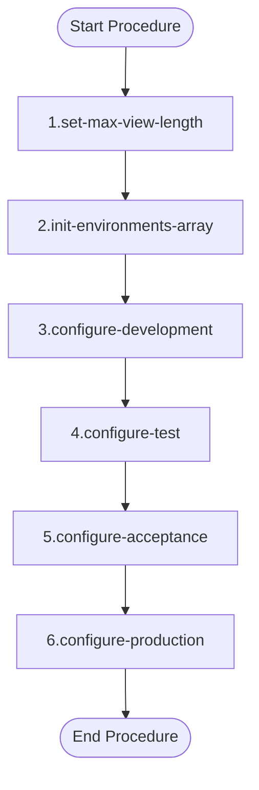

# Documentation: `.environments.ps1` [back](./../project.md)

## Brief Overview

This script configures deployment environments (Development, Test, Acceptance, and Production) for a Teradata-based data pipeline. It defines environment-specific parameters such as DSN connections and database targets. The script acts as a configuration file, typically used as input for a deployment pipeline to ensure the correct settings are applied per environment.

---

## Code NOT in a Function

This script contains no functions; all logic is defined inline.

---

### Overview

The script builds a list of environment configurations stored in the `$environments` array. Each environment block defines connection and deployment parameters tailored to a specific DTAP environment.

---

### Input Parameters

| Technical Name | Functional Name | Description |
|---|---|---|
| `$ni_max_length_view` | Max View Length | Maximum allowed character length for a Teradata view. Used to enforce simplicity in view design. |

---

### Output

| Technical Name | Functional Name | Description |
|---|---|---|
| `$environments` | Environments Array | A collection of environment configuration objects, each containing a name, max view length, and a list of parameters. |

---

### Dependencies

| Dependency | Description | Reference |
|---|---|---|
| PowerShell 5.1+ | Required to run the script | [PowerShell Documentation](https://learn.microsoft.com/en-us/powershell/) |
| Teradata ODBC Driver | Required for DSN-based connections referenced in `nm_dsn` | [Teradata ODBC Driver](https://downloads.teradata.com/) |

---

### Process Flow Diagram

1. **Set Max View Length**
   Sets the `$ni_max_length_view` variable to `16000`. This value is applied to all environments and enforces a maximum character length for Teradata views, encouraging developers to keep views concise.

2. **Initialize Environments Array**
   Creates an empty array `$environments` that will hold the configuration objects for each DTAP environment.

3. **Configure Development Environment**
   Builds a configuration object for the `Development` environment. Assigns `cd_environment = "O"`, DSN `OdbcDsnExampleName_O`, and target database `example_db_o`. Appends the object to `$environments`.

4. **Configure Test Environment**
   Builds a configuration object for the `Test` environment. Assigns `cd_environment = "T"`, DSN `OdbcDsnExampleName_T`, and target database `example_db_t`. Appends the object to `$environments`.

5. **Configure Acceptance Environment**
   Builds a configuration object for the `Acceptance` environment. Assigns `cd_environment = "A"`, DSN `OdbcDsnExampleName_A`, and target database `example_db_a`. Appends the object to `$environments`.

6. **Configure Production Environment**
   Builds a configuration object for the `Production` environment. Assigns `cd_environment = "P"`, DSN `OdbcDsnExampleName_P`, and target database `example_db_p`. Appends the object to `$environments`.

---

**Utilized ASN GPT Prompt**

> **LLM Used:** Claude (Anthropic)
> **Prompt Used:** [level-1-powershell-script](./../.ai_prompts/documentation-related-to-powershell/level-1-powershell-script.tx)

*end of document*
