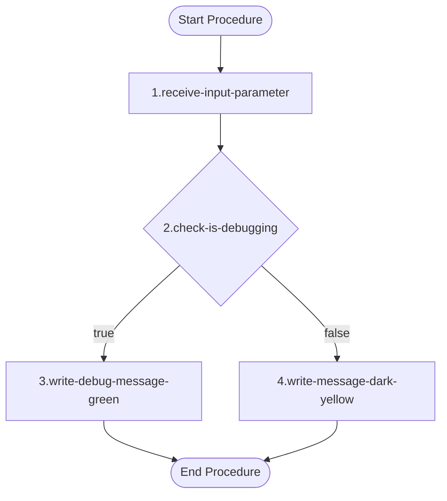

# Documentation: `example.ps1` [back](./../project.md)

## Brief Overview

This script contains a single function `ps_example` that serves as a demonstration/template function. It accepts a boolean parameter to indicate whether debugging is active, and outputs a message to the console with color-coding based on the debugging state. Intended as a reference example for developers learning the scripting conventions used in this project.

---

## Function: `ps_example`

### Overview

A simple example function that writes a status message to the console. The message color changes based on whether debugging mode is enabled (`Green`) or disabled (`DarkYellow`).

---

### Input Parameters

| Technical Name | Functional Name | Description |
|---|---|---|
| `$ip_is_debugging` | Is Debugging | Mandatory boolean flag. When `$true`, output is shown in green; when `$false`, output is shown in dark yellow. |

---

### Output

No return value. Output is written directly to the console via `Write-Host`.

---

### Dependencies

| Dependency | Description | Reference |
|---|---|---|
| PowerShell 5.1+ | Required to run the script | [PowerShell Documentation](https://learn.microsoft.com/en-us/powershell/) |
| `Write-Host` | Built-in PowerShell cmdlet used for console output | [Write-Host Documentation](https://learn.microsoft.com/en-us/powershell/module/microsoft.powershell.utility/write-host) |

---

### Process Flow Diagram

1. **Receive Input Parameter**
   The function receives the mandatory boolean parameter `$ip_is_debugging`. PowerShell will throw an error if this parameter is not provided when calling `ps_example`.

2. **Check Is Debugging**
   Evaluates the value of `$ip_is_debugging`. Based on the outcome, the flow branches into one of two paths: debug mode active (`$true`) or debug mode inactive (`$false`).

3. **Write Debug Message (Green)**
   When `$ip_is_debugging` is `$true`, a message is written to the console in **Green**, confirming the debugging state. The message includes the actual value of `$ip_is_debugging` using string interpolation.

4. **Write Message (Dark Yellow)**
   When `$ip_is_debugging` is `$false`, the same message is written to the console in **DarkYellow**, indicating that debugging is not active.

---

## Code NOT in a Function

There is no code outside of the `ps_example` function in this script. The function must be explicitly called with the required parameter to execute.

---

**Utilized ASN GPT Prompt**

> **LLM Used:** Claude (Anthropic)
> **Prompt Used:** [level-1-powershell-script](./../.ai_prompts/documentation-related-to-powershell/level-1-powershell-script.tx)

*end of document*
