# Delivery | Output for CSV

## Introduction

The Loantapes/DD-OSX team has developed a comprehensive three-layer data processing framework in Teradata SQL for Single Resolution Board (SRB) regulatory reporting. This integrated solution orchestrates the complete lifecycle from raw source data consolidation through CSV formatting to compliant export file generation.

The framework architecture consists of three interconnected layers. The **Union Layer** (`union_of`) consolidates data from two primary data warehouses (fdwh1_dwhi_dgs and fdwh2_spal_mbdt) using union-based operations, implementing hash-based versioning, temporal validity tracking, and intelligent row numbering to prevent ID conflicts across merged datasets. The **CSV Preparation Layer** (`prep_csv`) transforms consolidated data into CSV-formatted records with embedded headers, proper data type formatting, and delimiter management for multiple regulatory entities including counterparties, derivatives, liabilities, guarantees, and securities financing transactions. The **Export Layer** (`exports`) generates SRB-compliant file names following the pattern `TabCode_Country_LEI_SubmissionType_TimestampSubmission.csv` and manages dual storage locations (server and SharePoint) for nine submission types (B0100 through B9900) with Type A and Type B variant support.

Throughout all layers, the framework maintains comprehensive metadata including technical validity periods (`meta_dt_tech_valid_start/ended`), actual record flags (`meta_is_actual`), and SHA256 hashes for row content (`meta_ch_rh`), business keys (`meta_ch_bk`), and primary keys (`meta_ch_pk`). This metadata structure enables complete audit trails, change detection, and point-in-time analysis, supporting bitemporal data management with both business time (`functionalpit`) and technical time tracking.

## Components of the Framework

| SQL Object Type | Name | Description |
|-----------------|------|-------------|
| Table | [`prep_csv_tbl_aggregate_view`](./prep_csv/tables/prep_csv_tbl_aggregate_view.md) | Staging for aggregate view CSV records with ordering metadata |
| Table | [`prep_csv_tbl_counterparties_b`](./prep_csv/tables/prep_csv_tbl_counterparties_b.md) | Staging for counterparties B-variant CSV records |
| Table | [`prep_csv_tbl_counterparties`](./prep_csv/tables/prep_csv_tbl_counterparties.md) | Staging for standard counterparties CSV records |
| Table | [`prep_csv_tbl_derivatives`](./prep_csv/tables/prep_csv_tbl_derivatives.md) | Staging for derivatives data CSV records |
| Table | [`prep_csv_tbl_guarantees_provided_to_the_non_resolution_entity`](./prep_csv/tables/prep_csv_tbl_guarantees_provided_to_the_non_resolution_entity.md) | Staging for guarantees provided to non-resolution entities |
| Table | [`prep_csv_tbl_identification_of_the_report`](./prep_csv/tables/prep_csv_tbl_identification_of_the_report.md) | Staging for report identification information |
| Table | [`prep_csv_tbl_liabilities_issued_by_spvs_and_guaranteed_by_the_resolution_entity`](./prep_csv/tables/prep_csv_tbl_liabilities_issued_by_spvs_and_guaranteed_by_the_resolution_entity.md) | Staging for SPV-issued liabilities guaranteed by resolution entity |
| Table | [`prep_csv_tbl_main_liabilities_b`](./prep_csv/tables/prep_csv_tbl_main_liabilities_b.md) | Staging for main liabilities B-variant with 105 columns |
| Table | [`prep_csv_tbl_main_liabilities`](./prep_csv/tables/prep_csv_tbl_main_liabilities.md) | Staging for standard main liabilities data |
| Table | [`prep_csv_tbl_sfts`](./prep_csv/tables/prep_csv_tbl_sfts.md) | Staging for Securities Financing Transactions |
| Table | [`exports_tbl_file`](./exports/tables/exports_tbl_file.md) | Persistent storage for file metadata with full historization |
| Table | [`exports_tbl_folder`](./exports/tables/exports_tbl_folder.md) | Persistent storage for folder path configurations |
| View | [`exports_viw_file`](./exports/views/exports_viw_file.md) | Generates SRB-compliant file names dynamically |
| View | [`exports_viw_folder`](./exports/views/exports_viw_folder.md) | Retrieves folder location information for export paths |

## Framework Architecture

```mermaid
graph TB
    subgraph "Source Data Layer"
        DGS1[fdwh1_dwhi_dgs_tbl_aggregate_view]
        DGS2[fdwh1_dwhi_dgs_tbl_counterparties_b]
        DGS3[fdwh1_dwhi_dgs_tbl_main_liabilities_b]
        DGS4[fdwh1_dwhi_dgs_tbl_main_liabilities]
        
        MBDT1[fdwh2_spal_mbdt_tbl_aggregate_view]
        MBDT2[fdwh2_spal_mbdt_tbl_counterparties_b]
        MBDT3[fdwh2_spal_mbdt_tbl_main_liabilities_b]
        MBDT4[fdwh2_spal_mbdt_tbl_main_liabilities]
        MBDT5[fdwh2_spal_mbdt_tbl_derivatives]
        MBDT6[fdwh2_spal_mbdt_tbl_guarantees_provided_to_the_non_resolution_entity]
        MBDT7[fdwh2_spal_mbdt_tbl_identification_of_the_report]
        MBDT8[fdwh2_spal_mbdt_tbl_liabilities_issued_by_spvs_and_guaranteed_by_the_resolution_entity]
        MBDT9[fdwh2_spal_mbdt_tbl_sfts]
    end
    
    subgraph "Union Layer - Views"
        UV1[union_of_viw_aggregate_view]
        UV2[union_of_viw_counterparties_b]
        UV3[union_of_viw_main_liabilities_b]
        UV4[union_of_viw_main_liabilities]
    end
    
    subgraph "Union Layer - Tables"
        UT1[union_of_tbl_aggregate_view]
        UT2[union_of_tbl_counterparties_b]
        UT3[union_of_tbl_counterparties]
        UT4[union_of_tbl_main_liabilities_b]
        UT5[union_of_tbl_main_liabilities]
    end
    
    subgraph "CSV Preparation Layer - Views"
        CV1[prep_csv_viw_aggregate_view]
        CV2[prep_csv_viw_counterparties_b]
        CV3[prep_csv_viw_counterparties]
        CV4[prep_csv_viw_derivatives]
        CV5[prep_csv_viw_guarantees_provided_to_the_non_resolution_entity]
        CV6[prep_csv_viw_identification_of_the_report]
        CV7[prep_csv_viw_liabilities_issued_by_spvs_and_guaranteed_by_the_resolution_entity]
        CV8[prep_csv_viw_main_liabilities_b]
        CV9[prep_csv_viw_main_liabilities]
        CV10[prep_csv_viw_sfts]
    end
    
    subgraph "CSV Preparation Layer - Tables"
        CT1[prep_csv_tbl_aggregate_view]
        CT2[prep_csv_tbl_counterparties_b]
        CT3[prep_csv_tbl_counterparties]
        CT4[prep_csv_tbl_derivatives]
        CT5[prep_csv_tbl_guarantees_provided_to_the_non_resolution_entity]
        CT6[prep_csv_tbl_identification_of_the_report]
        CT7[prep_csv_tbl_liabilities_issued_by_spvs_and_guaranteed_by_the_resolution_entity]
        CT8[prep_csv_tbl_main_liabilities_b]
        CT9[prep_csv_tbl_main_liabilities]
        CT10[prep_csv_tbl_sfts]
    end
    
    subgraph "Export Layer"
        EV1[exports_viw_folder]
        EV2[exports_viw_file]
        ET1[exports_tbl_folder]
        ET2[exports_tbl_file]
        OUT[CSV Export Files]
    end
    
    DGS1 --> UV1
    MBDT1 --> UV1
    UV1 --> UT1
    
    DGS2 --> UV2
    MBDT2 --> UV2
    UV2 --> UT2
    UV2 --> UT3
    
    DGS3 --> UV3
    MBDT3 --> UV3
    UV3 --> UT4
    
    MBDT4 --> UV4
    DGS4 --> UV4
    UV4 --> UT5
    
    UT1 --> CV1
    UT2 --> CV2
    UT3 --> CV3
    UT4 --> CV8
    UT5 --> CV9
    
    MBDT5 --> CV4
    MBDT6 --> CV5
    MBDT7 --> CV6
    MBDT8 --> CV7
    MBDT9 --> CV10
    
    CV1 --> CT1
    CV2 --> CT2
    CV3 --> CT3
    CV4 --> CT4
    CV5 --> CT5
    CV6 --> CT6
    CV7 --> CT7
    CV8 --> CT8
    CV9 --> CT9
    CV10 --> CT10
    
    CT1 --> EV2
    CT2 --> EV2
    CT3 --> EV2
    CT4 --> EV2
    CT5 --> EV2
    CT6 --> EV2
    CT7 --> EV2
    CT8 --> EV2
    CT9 --> EV2
    CT10 --> EV2
    
    MBDT7 --> EV1
    MBDT7 --> EV2
    
    ET1 --> EV1
    ET2 -.historization.-> EV2
    
    EV1 --> OUT
    EV2 --> OUT
```



## Key Features

### 1. Multi-Source Data Consolidation

The framework intelligently merges data from two distinct data warehouses (fdwh1_dwhi_dgs and fdwh2_spal_mbdt) using UNION ALL operations with sophisticated row numbering logic to prevent ID conflicts. Source traceability is maintained through `nm_tech_source` and `ls_tech_source` fields.

### 2. Comprehensive Metadata Framework

All components utilize standardized metadata attributes for complete auditability:

- `meta_dt_tech_valid_start` / `meta_dt_tech_valid_ended`: Temporal validity tracking
- `meta_is_actual`: Current record identification
- `meta_ch_rh`: SHA256 hash of row content for change detection
- `meta_ch_bk`: Business key hash for deduplication
- `meta_ni_rn`: Row number within business key partition
- `meta_ch_pk`: Primary key hash combining business key, row number, and validity start

### 3. Automated CSV Formatting

The CSV preparation layer automatically generates properly formatted CSV records with embedded headers (row ordering 0), type-appropriate formatting (dates, decimals, strings), NULL value handling through NVL functions, and quote wrapping for string values.

### 4. SRB-Compliant File Naming

The export layer generates regulatory-compliant file names following the pattern `TabCode_Country_LEI_SubmissionType_TimestampSubmission.csv`, supporting nine submission types (B0100-B9900) with Type A/B variants where applicable.

### 5. Bitemporal Data Management

The framework supports both business time (`functionalpit`) and technical time tracking, enabling point-in-time queries, historical analysis, and complete audit trails.

### 6. Hash-Based Change Detection

SHA256 hashing throughout the framework enables efficient identification of data changes without comparing individual column values, supporting data quality monitoring and reconciliation processes.

### 7. Dual Storage Location Support

The export layer maintains both server and SharePoint folder paths through [`exports_tbl_folder`](./exports/tables/exports_tbl_folder.md), enabling flexible deployment across different storage infrastructures.

## Practical Coding Examples

### Example 1: End-to-End Data Flow Tracing

```sql
-- Trace a specific contract through the entire pipeline
-- from source consolidation to CSV export configuration

WITH union_data AS (
    SELECT 
        c0030 AS contract_id,
        c0050 AS balance,
        nm_tech_source AS source_system,
        functionalpit,
        meta_ch_rh AS union_hash
    FROM union_of_tbl_main_liabilities
    WHERE c0030 = 'CONTRACT123'
      AND meta_is_actual = 1
),
csv_data AS (
    SELECT 
        functionalpit,
        tx_record,
        meta_ch_rh AS csv_hash
    FROM prep_csv_tbl_main_liabilities
    WHERE meta_is_actual = 1
      AND tx_record LIKE '%CONTRACT123%'
),
export_config AS (
    SELECT 
        cd_submission,
        nm_file,
        dt_file
    FROM exports_viw_file
    WHERE cd_submission = 'B0200'
      AND meta_is_actual = 1
)
SELECT 
    u.contract_id,
    u.balance,
    u.source_system,
    u.functionalpit,
    c.tx_record AS csv_record,
    e.nm_file AS export_filename,
    e.dt_file AS export_timestamp
FROM union_data u
LEFT JOIN csv_data c ON u.functionalpit = c.functionalpit
CROSS JOIN export_config e
ORDER BY u.functionalpit DESC;
```

### Example 2: Data Quality Monitoring Across Layers

```sql
-- Monitor data consistency between union and CSV layers
-- by comparing record counts and hash distributions

WITH union_stats AS (
    SELECT 
        'union_of_tbl_counterparties' AS layer,
        COUNT(*) AS record_count,
        COUNT(DISTINCT meta_ch_bk) AS unique_business_keys,
        COUNT(DISTINCT nm_tech_source) AS source_systems,
        MAX(functionalpit) AS latest_pit
    FROM union_of_tbl_counterparties
    WHERE meta_is_actual = 1
),
csv_stats AS (
    SELECT 
        'prep_csv_tbl_counterparties' AS layer,
        COUNT(*) AS record_count,
        COUNT(DISTINCT meta_ch_bk) AS unique_business_keys,
        COUNT(DISTINCT nm_tech_source) AS source_systems,
        MAX(functionalpit) AS latest_pit
    FROM prep_csv_tbl_counterparties
    WHERE meta_is_actual = 1
      AND ni_ordering > 0  -- Exclude header row
)
SELECT 
    u.layer AS union_layer,
    c.layer AS csv_layer,
    u.record_count AS union_records,
    c.record_count AS csv_records,
    u.record_count - c.record_count AS record_difference,
    u.unique_business_keys AS union_keys,
    c.unique_business_keys AS csv_keys,
    u.latest_pit AS union_latest_date,
    c.latest_pit AS csv_latest_date,
    CASE 
        WHEN u.record_count = c.record_count THEN 'MATCHED'
        WHEN u.record_count > c.record_count THEN 'CSV MISSING RECORDS'
        ELSE 'CSV HAS EXTRA RECORDS'
    END AS status
FROM union_stats u
CROSS JOIN csv_stats c;
```

### Example 3: Historical Export File Analysis

```sql
-- Analyze export file generation patterns over time
-- to identify submission frequencies and storage locations

SELECT 
    f.cd_submission,
    f.nm_submission,
    f.cd_submission_type,
    COUNT(*) AS total_exports,
    MIN(f.dt_file) AS first_export,
    MAX(f.dt_file) AS latest_export,
    CAST(MAX(f.dt_file) AS DATE) - CAST(MIN(f.dt_file) AS DATE) AS days_span,
    fo.tx_folderpath_server AS server_location,
    fo.tx_folderpath_sharepoint AS sharepoint_location,
    CASE 
        WHEN COUNT(*) > 100 THEN 'HIGH FREQUENCY'
        WHEN COUNT(*) BETWEEN 50 AND 100 THEN 'MEDIUM FREQUENCY'
        ELSE 'LOW FREQUENCY'
    END AS submission_frequency
FROM exports_tbl_file f
INNER JOIN exports_viw_folder fo
    ON f.cd_lei_reporting_institution = fo.cd_lei_reporting_institution
WHERE f.meta_dt_tech_valid_start >= ADD_MONTHS(CURRENT_DATE, -6)
GROUP BY 
    f.cd_submission,
    f.nm_submission,
    f.cd_submission_type,
    fo.tx_folderpath_server,
    fo.tx_folderpath_sharepoint
ORDER BY 
    total_exports DESC,
    f.cd_submission;
```

---

**Utilized ASN GPT Prompt**

This was generated with "Complex Claude 4 sonnet"-version

<details>
<summary>the prompt</summary>

Act like a Teradat SQL expert: 
- Given the previous texts, create summary overview of the framework utilized by the Loantapes/DD-OSX team(s). Handle the following topics
- Leave out "${nm_database_target}" when referencing the procedure, table and/or view name(s) 
- virutal schema the part before "_tbl", "_viw_" of "_usp_" is the virual schema name
- If reference a SQL object make it into a clickable link to the documentation use this format "[`sql-object`](./<virtual-schema-name>/tables/<name-of-table>.md)" for tables and for procedure use "[`sql-object`](./<virtual-schema-name>/procedures/<name-of_procedure>.md)"

- The document structure handle the following topic, in the given order
  - Introduction (MAx 500 words, DO NOT make if longer then is required)
  - Components of the Framework (present as a table with columns SQL Objecttype (procedure, Table or View), Name, Description)
  - Add mermaid Diagram on how the various sql-objects are used and related to one another
  - Let the SQL-objects correlate to the Mermaid diagram, the text of diagram componnets must follow pattern `sql-object-name`.
  - Key Features
  - Provide 2 ro 3 practical coding examples

- At the End of the document, add the following in the give order.
  - divider line
  - text **Utilized ASN GPT Prompt**
  - This was generated with "Complex Claud 4 sonnet"-version
  - calapsable text block with the used ASN GPT prompt, title "the prompt"
  - Add final blank line
  - Add the text "*end of document*"
  - Add final blank line

</details>

*end of document*